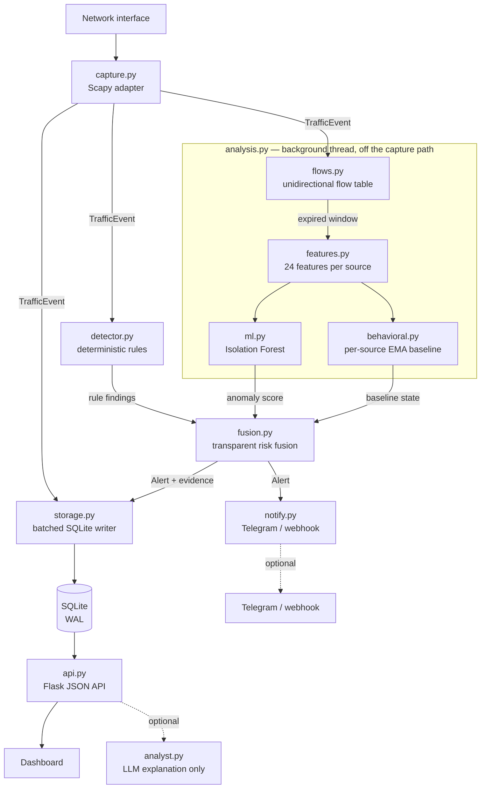

<div align="center">

# NEMOS

**Network Exposure Monitoring & Operations System**

A local-first, explainable network monitoring and intrusion-detection platform
for systems and networks you own or are authorized to monitor.

[](https://github.com/gautam11652-eng/NEMOS/actions/workflows/ci.yml)
[](https://www.python.org/)
[](LICENSE)

</div>

---

## What NEMOS is

NEMOS captures live network traffic, aggregates it into **unidirectional
flows**, and runs three independent detection layers over them: bounded
deterministic rules, a per-source statistical baseline, and an unsupervised
machine-learning anomaly model. Findings are fused into a transparent risk
score, correlated into incidents, and presented in a local SOC dashboard with
the evidence behind every alert.

It runs entirely on one machine. The ML model is trained and executed locally
with scikit-learn; no cloud service, paid API or internet connection is required
for detection. Nothing leaves the machine unless you configure an alert channel.

## What NEMOS is not

This section exists because these distinctions matter more than marketing does.

- **The ML layer detects anomalies, not attacks.** An Isolation Forest reports
  that a traffic window is statistically unlike the traffic it was trained on.
  That is not the same as hostile. Statistical evidence alone is capped below
  CRITICAL and never assigns a MITRE ATT&CK technique.
- **The statistical baseline is not machine learning.** It is an exponentially
  weighted mean and variance per source with an explicit sigma threshold. NEMOS
  keeps the two layers separately labelled, in the data model and in the
  interface, because conflating them would overstate both.
- **An anomaly score is not a probability.** It measures how far a window falls
  into the tail of the training distribution. See [Detection](#detection).
- **A risk score is not a probability of compromise.** It is analyst triage
  priority, computed from a documented formula you can reproduce by hand.
- **An alert is not proof of an attack.** Detection thresholds are conservative
  by design and false positives are expected. NEMOS is a monitoring tool.
- **The optional LLM analyst performs no detection.** It explains findings the
  other layers already made, and its output is discarded if it references
  anything not present in the evidence.
- **It does not block, contain, or respond.** There is no enforcement path, by
  design. The dashboard never executes containment actions.

## Highlights

- Live packet capture via Scapy, with explicit capture-state reporting
- Bounded, stateful detections: TCP SYN scans, UDP port scans, vertical port
  scans, network fan-out, ICMP sweeps and floods, SYN floods, DNS bursts,
  service-connection bursts and ARP mapping changes
- **Unidirectional flow aggregation** — the five-tuple is used exactly as
  observed, never canonicalised, so a one-way tap is a first-class deployment
- **24 engineered features per source per window**: rates, per-flow statistics,
  TCP flag ratios, protocol ratios, and Shannon entropy over destinations/ports
- **Unsupervised ML anomaly detection** (Isolation Forest, scikit-learn) trained
  locally on your own benign traffic, with an explainable score and the
  contributing features surfaced for every finding
- Per-source statistical baseline with noise floors and multi-feature
  corroboration, so one noisy metric cannot raise an alert alone
- **Transparent hybrid risk fusion** — every score carries the arithmetic that
  produced it
- Incident correlation with stable incident IDs and preserved evidence
- MITRE ATT&CK technique references **only** where the observed behaviour
  supports the mapping; generic anomalies stay explicitly unmapped
- Optional outbound alerting to Telegram or a webhook, with a severity floor,
  per-finding cooldown and rate limiting
- SQLite WAL storage behind a single batched writer thread with bounded,
  priority-aware backpressure
- Optional, evidence-constrained LLM analyst that explains findings and is
  never required for detection
- Loopback-only by default; remote binds require a token
- 456 automated tests, CI across Python 3.10–3.13, lint and dependency audit

## Architecture



Four rules govern this design:

1. **The capture path stays cheap.** Per packet it does one dictionary
   operation under a short lock. Window expiry, feature extraction, batched
   inference and fusion all run on the analysis thread, so inference latency can
   never reach packet capture. Measured on the capture path: 5,000–38,000
   packets/sec depending on window occupancy, and 0.3 ms of inference per
   source-window off it. See [Performance](#performance) — the range matters
   more than the peak.
2. **Storage precedes delivery.** An alert is queued for persistence before it
   is queued for notification, so an unreachable Telegram API can never cost a
   recorded detection.
3. **No layer is the sole source of truth.** Deterministic rules set the risk
   floor; statistical layers may raise it but never lower it, and alone they
   cannot reach CRITICAL or name an ATT&CK technique.
4. **An LLM is never in the detection path.** It receives finished evidence and
   returns prose, or NEMOS runs identically without it.

See [`docs/ARCHITECTURE.md`](docs/ARCHITECTURE.md) for module-level detail.

## Requirements

- Python 3.10 or newer
- Linux for packet capture (`CAP_NET_RAW`); the dashboard and API run anywhere

## Quick start

```bash
git clone https://github.com/gautam11652-eng/NEMOS.git
cd NEMOS
python3 -m venv .venv
source .venv/bin/activate
python -m pip install --upgrade pip
pip install -r requirements.txt
python main.py
```

Open <http://127.0.0.1:5000>.

To capture on a specific interface:

```bash
NEMOS_INTERFACE=eth0 python main.py
```

If capture fails with a permission error, grant only the capture capability
rather than running the web application as root — see
[Deployment](#deployment). The dashboard reports capture state explicitly, so a
permission failure appears as `CAPTURE BLOCKED` rather than as silent zeroes.

### Try it without capture

To see the detection pipeline end to end without touching a network interface:

```bash
python tools/validate_detection.py
```

This generates synthetic RFC 5737 documentation-address telemetry in memory. It
transmits nothing and scans nothing.

## Configuration

NEMOS reads a `.env` file next to `main.py` at startup. Real environment
variables always take precedence, so a systemd unit or an explicit `export` is
never overridden by a stale file. Copy `.env.example` to `.env` to begin.

### Core

| Variable | Default | Purpose |
| --- | --- | --- |
| `NEMOS_HOST` | `127.0.0.1` | Bind address |
| `NEMOS_PORT` | `5000` | Bind port |
| `NEMOS_INTERFACE` | *(auto)* | Capture interface |
| `NEMOS_CAPTURE` | `true` | Enable packet capture |
| `NEMOS_DB` | `data/nemos.db` | SQLite path |
| `NEMOS_API_TOKEN` | *(none)* | Required for any non-loopback bind |
| `NEMOS_TRUSTED_HOSTS` | *(none)* | Required for wildcard binds |
| `NEMOS_LOG_LEVEL` | `INFO` | Logging level |

### Retention and throughput

| Variable | Default | Purpose |
| --- | --- | --- |
| `NEMOS_MAX_TRAFFIC` | `100000` | Traffic rows retained |
| `NEMOS_MAX_ALERTS` | `10000` | Alert rows retained |
| `NEMOS_DB_BATCH` | `250` | Rows per write batch |
| `NEMOS_DB_FLUSH_SECONDS` | `0.5` | Maximum flush interval |
| `NEMOS_DASHBOARD_LIMIT` | `100` | Default dashboard page size |

### Flow analysis and ML

| Variable | Default | Purpose |
| --- | --- | --- |
| `NEMOS_ANALYSIS` | `true` | Enable windowed flow analysis and ML scoring |
| `NEMOS_ANALYSIS_WINDOW` | `10.0` | Aggregation window in seconds — **must match the model's training window** |
| `NEMOS_MAX_FLOWS` | `20000` | Bound on the in-memory flow table |
| `NEMOS_MAX_EVENTS` | `1000` | Events retained per source for the rules. Detection cost per packet is linear in this — see [Performance](#performance) |
| `NEMOS_PERSIST_FLOWS` | `true` | Store aggregated flows in SQLite |
| `NEMOS_MODEL_DIR` | `data/model` | Where the trained model is loaded from |

### Optional LLM analyst

Off unless `NEMOS_LLM_PROVIDER` is set. Nothing is sent anywhere until it is.

| Variable | Default | Purpose |
| --- | --- | --- |
| `NEMOS_LLM_PROVIDER` | *(none)* | `anthropic`, `openai` or `ollama` (local) |
| `NEMOS_LLM_MODEL` | provider default | Model name |
| `NEMOS_LLM_URL` | provider default | Only overridable for `ollama`, and only to a loopback address |
| `NEMOS_LLM_TIMEOUT` | `30` | Request timeout in seconds |
| `ANTHROPIC_API_KEY` / `OPENAI_API_KEY` | *(none)* | Required by the hosted providers |

For a fully offline deployment use `ollama`, which keeps the model on the same
machine. NEMOS refuses to redirect a hosted provider's endpoint, so evidence
about your network cannot be retargeted by a misconfigured variable.

### Baseline tuning

| Variable | Default | Purpose |
| --- | --- | --- |
| `NEMOS_BEHAVIOR_ALPHA` | `0.15` | EMA smoothing factor |
| `NEMOS_BEHAVIOR_MIN_SAMPLES` | `8` | Warm-up before the baseline can alert |
| `NEMOS_BEHAVIOR_SIGMA` | `3.0` | Deviation threshold |
| `NEMOS_BEHAVIOR_SAMPLE_SECONDS` | `5.0` | Sampling cadence |

## Unidirectional traffic

The SIH problem statement concerns **unidirectional IP traffic**, and NEMOS
takes that literally rather than assuming both halves of a conversation are
visible.

A flow is keyed by the five-tuple exactly as observed:

```
(source, destination, source_port, destination_port, protocol)
```

There is no canonicalisation and no address ordering. Traffic from A to B and
traffic from B to A produce **two independent records that are never merged**.
Two reasons:

- A one-way tap, a SPAN port carrying a single direction, or an asymmetric route
  may only ever show one side. A representation assuming both directions would
  silently misreport in exactly that deployment.
- Direction carries the signal. One host contacting two hundred destinations is
  reconnaissance; two hundred hosts answering it is not. Merging the directions
  destroys the asymmetry detection depends on.

**No feature requires a response packet.** Every one of the 24 features is
computed from the observed direction alone — counts, rates, per-flow statistics,
flag ratios, protocol ratios and entropies. Nothing is inferred from traffic
that was never seen, and no feature is silently defaulted to stand in for a
missing reverse flow.

Where reverse traffic *is* available and correlation is wanted,
`FlowTable.reverse_of()` returns the opposite record without modifying or
merging either side. Both directions remain separate rows in the `flows` table
and in `GET /api/flows`.

## Detection

NEMOS runs three independent layers and keeps them distinguishable in the data
model, the API and the interface. They answer different questions:

| Layer | Question it answers | Can name an ATT&CK technique? |
| --- | --- | --- |
| Deterministic rules | Was a specific, named behaviour observed? | Yes |
| Statistical baseline | Is this host behaving unlike *itself*? | No |
| ML anomaly model | Is this window unlike the *trained* traffic? | No |

### Deterministic rules

Bounded, stateful counters over a sliding window produce 27 findings. Each
carries the evidence that triggered it — the ports observed, the SYN ratio, the
destination count — and every finding whose evidence cannot support a stronger
claim says so in its own evidence.

| Stage | Findings |
| --- | --- |
| Reconnaissance | `PORT_SCAN` (external source), `TCP_SYN_SCAN`, `UDP_PORT_SCAN`, `TCP_NULL_SCAN`, `TCP_FIN_SCAN`, `TCP_XMAS_SCAN` |
| Discovery | `PORT_SCAN` (internal source), `NETWORK_FANOUT`, `ICMP_SWEEP`, `SERVICE_CONNECTION_BURST` |
| Credential access | `CREDENTIAL_BRUTE_FORCE`, `PASSWORD_SPRAYING`, `ARP_MAPPING_CHANGE` |
| Lateral movement | `LATERAL_MOVEMENT` (names RDP, SMB, SSH, VNC or WinRM from the observed port) |
| Command and control | `C2_BEACONING`, `DNS_TUNNELING_PATTERN`, `ICMP_TUNNELING_PATTERN`, `TOR_CONNECTION_PATTERN`, `NON_STANDARD_PORT_TRAFFIC`, `INGRESS_TOOL_TRANSFER`, `DNS_BURST` |
| Exfiltration | `DATA_EXFILTRATION_VOLUME`, `DATA_EXFILTRATION_OVER_C2` |
| Impact | `SYN_FLOOD_PATTERN`, `ICMP_FLOOD_PATTERN`, `SERVICE_DENIAL_OF_SERVICE`, `REFLECTION_AMPLIFICATION`, `CRYPTO_MINING_PATTERN` |

Three of these are worth singling out:

- **`C2_BEACONING`** measures the coefficient of variation of the intervals
  between contacts with one destination. Periodicity is where a unidirectional
  tap is strongest: the callback is visible without ever seeing a reply. Known
  periodic services (NTP, DNS, DHCP) are excluded, because flagging them would
  bury real callbacks in benign noise.
- **`DATA_EXFILTRATION_OVER_C2`** is not a separate signal but a correlation:
  bulk transfer to a host the same source was *already* beaconing to. Two
  findings combining into a stronger claim than either supports alone.
- **`PASSWORD_SPRAYING`** exists because `CREDENTIAL_BRUTE_FORCE` counts per
  target and therefore cannot see it — few attempts each, across many hosts, is
  precisely the shape that evades per-account lockout.

Port-based identifications (mining, Tor, non-standard ports) are heuristics and
are labelled as such in their own evidence, with confidence set accordingly.

### Statistical baseline

Each source host gets a profile of four features: packet rate, byte rate, unique
destinations and unique ports. Each is tracked as an exponentially weighted mean
and variance, sampled on a fixed cadence so a rolling window cannot let the
baseline quietly adapt to the burst it is supposed to catch.

Three properties keep this honest:

- **Warm-up.** A profile cannot raise an alert until it has `MIN_SAMPLES`
  observations. A host with no history is never called anomalous.
- **Noise floors.** A zero variance during a stable warm-up cannot turn a
  one-unit change into an effectively infinite z-score.
- **Corroboration.** The strongest deviation must be supported by an independent
  dimension unless it is extreme, so a single noisy feature is not treated as
  hostile.

Baseline state is always one of `NO_BASELINE`, `NORMAL`, `DEVIATING` or
`HIGHLY_DEVIATING`. A host without enough history is `NO_BASELINE` — never
"normal" and never "anomalous", because the evidence supports neither.

**This is a statistical model, not a trained one**, and NEMOS does not call it
AI or ML anywhere.

### Machine-learning anomaly detection

An **Isolation Forest** (scikit-learn) fitted on feature vectors from traffic
you consider benign. It is unsupervised: it is never shown an attack, only what
ordinary traffic on *your* network looks like, and it reports how unusual a
window is relative to that.

**Why Isolation Forest.** The requirement is to flag unusual traffic without
labelled attack data, on a live sensor, explainably. Isolation Forest fits: it
needs no labels, trains in seconds on tens of thousands of windows, scores in
sub-millisecond time per window, has no distance metric to tune, and degrades
gracefully in the moderate dimensionality (24 features) used here. Local Outlier
Factor scores by local density and needs the training set retained at inference,
which is heavier for a long-running sensor. One-Class SVM scales poorly with
sample count and is sensitive to kernel and `nu` choices that are hard to
justify to a reviewer. Both remain reasonable alternatives; the engine is a
single class behind a small interface if you want to substitute one.

**Features** — 24 per source per window, all derivable from observed metadata,
none from payload:

| Group | Features |
| --- | --- |
| Volume | `packets`, `bytes`, `packets_per_second`, `bytes_per_second` |
| Flow shape | `flow_count`, `mean_flow_duration`, `mean_packets_per_flow`, `mean_bytes_per_flow` |
| Fan-out | `unique_destinations`, `unique_destination_ports`, `unique_source_ports` |
| Dispersion | `destination_entropy`, `destination_port_entropy` |
| Packet size | `mean_packet_size`, `stddev_packet_size`, `small_packet_ratio` |
| TCP flags | `syn_ratio`, `ack_ratio`, `rst_ratio`, `fin_ratio` |
| Protocol mix | `tcp_ratio`, `udp_ratio`, `icmp_ratio`, `dns_ratio` |

Entropy earns its place: it separates "many packets to one destination" from
"many packets spread evenly across destinations", which a unique count cannot.

**The anomaly score (0–100) is not a probability.** `decision_function` returns
an unbounded, scale-free number. At training time NEMOS records that value's
distribution; at inference a window is placed against it in **robust deviation
units**:

```
deviation = (median − raw) / (median − 5th percentile)
```

| Deviation below the training median | Score | Band |
| --- | --- | --- |
| up to 1 unit | 0 | NORMAL |
| 1 – 2 units | 0 – 40 | NORMAL |
| 2 – 2.5 units | 40 – 70 | SUSPICIOUS |
| beyond 2.5 units | 70 – 100 | ANOMALOUS / HIGHLY_ANOMALOUS |

Both anchors are robust by design. An earlier implementation anchored on the
training *minimum* and was wrong in an instructive way: the minimum is a single
sample, so one unusual training window set the whole scale — measured here it
sat at −0.255 against a 5th percentile of −0.030, stretching the band until a
259-port SYN scan scored 65. The bands above come from measured separation on
the bundled scenarios: held-out normal traffic reached 1.7 deviation units,
every abnormal scenario fell between 2.6 and 3.3.

**Explainability.** An Isolation Forest exposes no per-feature attribution, so
NEMOS reports which features are furthest from their training mean, in standard
deviations. A real assessment from the bundled port-scan scenario:

```
anomaly 94/100 (highly anomalous)
  unique destination ports is 317.2 standard deviations above the training mean
  flow count is 288.1 standard deviations above the training mean
  packets per second is 48.5 standard deviations above the training mean
```

**The aggregation window is part of the model contract.** Counts and rates scale
with it, so a model fitted on 10-second windows describes a different
distribution from one applied to 2-second windows. Training records the window;
loading refuses a mismatch rather than producing confident, wrong scores.

### Hybrid risk fusion

The three layers are combined by an explicit, reproducible formula — never
`final = ml_score × 100`.

**When a deterministic rule fired:**

```
risk = strongest rule risk          (the floor)
     + ML contribution              (0–25, scaled above the NORMAL band)
     + baseline contribution        (0, 8 or 15 by state)
     + corroboration bonus          (10 when a statistical layer agrees)
     capped at 100
```

**When no rule fired**, statistics must carry the finding alone, under a
stricter mapping and a lower ceiling:

```
risk = max(ML tail risk, baseline risk)     — max, not sum: the two are usually
     + 10 if both fired                       two views of one underlying change
     capped at 84                            — statistical evidence alone cannot
                                               reach CRITICAL
```

Nothing below the ANOMALOUS band contributes on this path: a merely SUSPICIOUS
window is the ordinary jitter of real traffic, and alerting on it trains
operators to ignore the sensor.

Every assessment carries the arithmetic in its `explanation` object. If you
cannot reproduce the risk score by hand from the signals, that is a bug.
Verdicts are worded for what was observed — `POSSIBLE_RECONNAISSANCE`,
`BEHAVIOR_CONSISTENT_WITH_ATTACK` — never "confirmed attack".

Incidents combine the strongest constituent alert with bounded bonuses for
independent signals; see [`nemos/intelligence.py`](nemos/intelligence.py).

### ATT&CK mapping

A technique ID is attached only where the observed network behaviour supports
it. Scanning maps to `T1046`; DNS tunnelling patterns to `T1071.004`; floods to
`T1498`/`T1498.001`; ARP manipulation to `T1557.002`. A generic behavioural
anomaly is reported as an unmapped signal with a stated reason, rather than
being assigned a technique it does not evidence.

## Training the model

Training is a deliberate, out-of-band operator action. A sensor that retrained
itself on live traffic would learn to accept whatever it is currently seeing —
including an attack in progress.

### From your own captured traffic (recommended)

Run NEMOS with capture enabled for a representative period — ideally a full
daily cycle — that you are reasonably confident is clean. Then:

```bash
python tools/train_model.py --source database --window 10
```

The model learns *your* network's normal, not a generic idea of normal.

Inspect the data before fitting anything to it:

```bash
python tools/train_model.py --source database --dry-run
```

### From synthetic traffic (evaluation and demo)

```bash
python tools/train_model.py --source synthetic --window 10
```

This generates RFC 5737 documentation traffic in memory. It proves the pipeline
works; it says nothing about your network, and the tool says so on completion.

### Model lifecycle

- **Persistence** — model and calibration are written atomically to
  `data/model/`, with metadata recording the feature schema, feature names,
  aggregation window, sample count, scikit-learn version, seed and timestamp.
- **Loading** — automatic at startup. `GET /api/analysis` reports model state,
  version, training provenance and windows scored.
- **Reproducibility** — a fixed seed means two training runs over the same data
  produce identical scores.
- **Retraining** — rerun the command; the next start picks the new model up.
- **Refusal, not silence.** Training is refused for fewer than 50 windows, fewer
  than 20 *distinct* windows (repeated identical windows teach nothing and
  produce a model that scores real anomalies as normal), or a corpus mixing
  aggregation windows. Loading is refused on a schema, feature-name or window
  mismatch. Every refusal names the fix.
- **Absence is not failure.** No model, a corrupt model, or scikit-learn not
  installed leaves NEMOS running on deterministic rules plus the statistical
  baseline, with the reason reported in the API and on the dashboard.

## Demonstration

A controlled, offline demonstration of the whole pipeline across nine traffic
scenarios:

```bash
python tools/demo.py                        # all scenarios
python tools/demo.py --scenario port_sweep  # one
python tools/demo.py --no-train             # the rules-only degraded path
```

Everything is generated in memory using RFC 5737 documentation addresses. No
packet is transmitted, no interface is touched, no host is contacted. The
scenarios are traffic *shapes*, not exploits.

Scenarios: normal traffic, connection burst, destination fan-out, port sweep,
abnormal TCP (SYN flood pattern), unusual UDP, DNS deviation, sudden rate
deviation, ICMP sweep.

Results from the bundled run — normal traffic produces no finding, and every
abnormal scenario is detected:

| Scenario | Flows | Rules | Anomaly | Risk | Verdict |
| --- | --- | --- | --- | --- | --- |
| normal_traffic | 189 | 0 | – | 0 | NO_FINDING |
| connection_burst | 396 | 2 | 100 | 100 | POSSIBLE_RECONNAISSANCE |
| destination_fanout | 199 | 3 | 91 | 100 | POSSIBLE_RECONNAISSANCE |
| port_sweep | 259 | 3 | 94 | 100 | POSSIBLE_RECONNAISSANCE |
| abnormal_tcp | 621 | 2 | 100 | 100 | POSSIBLE_RECONNAISSANCE |
| unusual_udp | 119 | 2 | 100 | 100 | POSSIBLE_RECONNAISSANCE |
| dns_deviation | 300 | 1 | 100 | 100 | BEHAVIOR_CONSISTENT_WITH_ATTACK |
| rate_deviation | 1239 | 2 | 84 | 100 | POSSIBLE_RECONNAISSANCE |
| icmp_sweep | 119 | 3 | 100 | 100 | POSSIBLE_RECONNAISSANCE |

## Alert delivery

NEMOS records findings locally by default. It can also push them to Telegram or
a webhook. Delivery is off until you configure a channel, and it never blocks
packet capture.

### Verifying delivery

NEMOS tests the delivery path against a mock Bot API, and the whole chain has
been exercised end to end against the live one -- live capture through to a
message arriving in a real chat. What it cannot test is *your* token and chat
id. Run:

```bash
python tools/verify_telegram.py
```

It sends one clearly-labelled test message and, on failure, names the likely
cause -- wrong token, unreachable chat, bot blocked, bot never started, missing
post rights, or no route to api.telegram.org. Credentials are read from the
environment or `.env`, never from arguments, and never printed.

### Telegram

1. Open Telegram and start a chat with **@BotFather**.
2. Create a bot with `/newbot` and copy the token.
3. Send a message to your bot, then obtain your chat ID.
4. Add both to `.env`:

```env
TELEGRAM_BOT_TOKEN=your_bot_token
TELEGRAM_CHAT_ID=your_chat_id
```

### Webhook

```env
NEMOS_WEBHOOK_URL=https://your-collector.example/hook
NEMOS_WEBHOOK_TOKEN=optional_bearer_token
```

The URL must be HTTPS unless it points at loopback: alert bodies describe your
network and are not sent in cleartext. Redirects are refused rather than
followed, so a redirect cannot downgrade the transport or retarget the payload.

### Tuning what gets sent

| Variable | Default | Purpose |
| --- | --- | --- |
| `NEMOS_NOTIFY` | `true` | Master switch |
| `NEMOS_NOTIFY_MIN_SEVERITY` | `HIGH` | `LOW`, `MEDIUM`, `HIGH`, `CRITICAL` |
| `NEMOS_NOTIFY_COOLDOWN` | `300` | Seconds before the same finding repeats |
| `NEMOS_NOTIFY_RATE` | `12` | Maximum messages per minute |
| `NEMOS_NOTIFY_TIMEOUT` | `5.0` | Per-request timeout |
| `NEMOS_NOTIFY_QUEUE` | `256` | Pending-delivery queue size |

The cooldown and rate limit exist so a port scan cannot turn the sensor into a
message flood. **Suppressed alerts are still recorded and still appear on the
dashboard** — only the outbound copy is dropped, and every suppression is
counted in `/api/notifications`.

The bot token is never returned by any endpoint and is redacted from logs and
error messages.

## API

| Endpoint | Purpose |
| --- | --- |
| `GET /api/health` | Liveness (public even when a token is set) |
| `GET /api/dashboard` | Consolidated dashboard snapshot (ETag-cached) |
| `GET /api/stats` | Telemetry counters |
| `GET /api/alerts` | Recent alerts, filterable |
| `GET /api/alerts/<id>` | Single alert with evidence |
| `GET /api/incidents` | Correlated incidents |
| `GET /api/incidents/<incident_id>` | Incident detail and triage summary |
| `GET /api/hosts` | Host risk index |
| `GET /api/hosts/<ip>` | Per-host investigation view |
| `GET /api/techniques` | ATT&CK catalog with observed counts |
| `GET /api/flows` | Unidirectional flows; `active=true` for the live table |
| `GET /api/analysis` | Windowed-analysis and ML model health |
| `GET /api/anomalies` | Recent fused assessments with full arithmetic |
| `GET /api/windows` | Recent completed analysis windows |
| `GET /api/baselines`, `GET /api/baselines/<ip>` | Per-host baseline state |
| `GET /api/analyst` | Optional LLM analyst status |
| `POST /api/analyst/ask` | Ask the analyst about an incident or host |
| `GET /api/traffic` | Recent traffic events |
| `GET /api/status` | Capture, writer and delivery health |
| `GET /api/metrics` | Writer and delivery metrics |
| `GET /api/notifications` | Alert-delivery configuration and health |
| `POST /api/packet` | Test/compatibility ingestion |
| `POST /api/alerts/<id>/ack` | Acknowledge an alert |
| `POST /api/alerts/clear` | Clear alerts |

### Filtering alerts

`GET /api/alerts` accepts `severity` (repeatable), `source`, `threat`,
`technique`, `acknowledged`, `since` and `limit`:

```bash
curl 'http://127.0.0.1:5000/api/alerts?severity=CRITICAL&severity=HIGH&acknowledged=false'
curl 'http://127.0.0.1:5000/api/alerts?source=192.0.2.10&since=2026-01-01'
```

Every filter is validated and passed as a bound parameter.

`GET /api/flows` accepts `source`, `destination`, `protocol`, `limit` and
`active`. Both directions of a conversation appear as separate rows:

```bash
curl 'http://127.0.0.1:5000/api/flows?source=192.0.2.10'
curl 'http://127.0.0.1:5000/api/flows?active=true'
```

`POST /api/analyst/ask` takes a **target**, never evidence — NEMOS assembles the
bundle from its own storage, so the endpoint cannot be used as a general-purpose
LLM proxy:

```bash
curl -X POST http://127.0.0.1:5000/api/analyst/ask \
  -H 'Content-Type: application/json' \
  -d '{"question":"why is this host suspicious?","host":"192.0.2.10"}'
```

When `NEMOS_API_TOKEN` is set, all `/api/*` endpoints except `/api/health`
require an `X-NEMOS-Token` header. The dashboard prompts for the token and keeps
it in `sessionStorage` only.

## Dashboard

A local SOC interface with a live detection timeline, security posture summary,
correlated-incident investigation with evidence and recommended next steps, a
host risk index, an ATT&CK coverage view, a connection graph, and sensor health
including capture state and writer backpressure.

The **ML Detection** section shows:

- **Model status** — loaded or not trained, version, training timestamp,
  training window count, windows scored, aggregation window
- **Per-assessment detail** — anomaly score, confidence, risk, baseline state
- **Hybrid verdict** — the fusion arithmetic, the layers that contributed, and
  the ATT&CK techniques (or an explicit note that statistical evidence does not
  name one)
- **Why this was flagged** — the contributing features and their deviations

Every displayed value maps to a real backend field; a test enforces that and
forbids overstated wording such as "AI detected attack".

## Testing

```bash
pip install -r requirements-dev.txt
python -m pytest -q                              # 456 tests
python -m compileall -q main.py nemos tests      # syntax
ruff check .                                     # lint
python -m pip_audit -r requirements.txt          # dependency audit
```

`make test`, `make compile`, `make audit` and `make demo` wrap the common ones.
CI runs the suite on Python 3.10–3.13 plus lint, dependency audit and a package
build on every push and pull request.

For a full environment check on Kali or another Debian-based host:

```bash
./scripts/verify-kali.sh
```

## Deployment

Run capture with the minimum capability rather than as root. From the project
root on a Debian-based host:

```bash
sudo ./install.sh
```

This creates the `nemos` service account, installs pinned dependencies into
`/opt/nemos/.venv`, creates `/var/lib/nemos` for the database, installs the
systemd unit and starts it. Configuration lives at `/etc/nemos/nemos.env`, and
the dashboard stays local-only at `http://127.0.0.1:5000` by default.

```bash
sudo systemctl status nemos
sudo journalctl -u nemos -f
```

The unit grants `CAP_NET_RAW` only and keeps the application process
unprivileged, while permitting the `AF_PACKET` and `AF_NETLINK` socket families
Scapy needs. See [`docs/DEPLOYMENT.md`](docs/DEPLOYMENT.md) for the manual
layout and for the post-install smoke test.

### Remote access

Do not bind to `0.0.0.0` casually. If you need a remote listener:

```bash
export NEMOS_HOST=0.0.0.0
export NEMOS_API_TOKEN="$(python3 -c 'import secrets; print(secrets.token_urlsafe(32))')"
export NEMOS_TRUSTED_HOSTS=192.168.1.50   # hostnames/IPs clients will actually use
python main.py
```

NEMOS refuses to start on a wildcard bind without both. Put HTTPS and a reverse
proxy in front of any deployment outside a trusted local network.

## Performance

Every number here comes from `tools/benchmark.py`, which ships in the
repository so you can check it on your own hardware rather than trusting it:

```bash
python tools/benchmark.py
```

Measured on Python 3.11, 12,000 packets per profile:

| Profile | Distinct sources | Packets/sec | µs/packet |
| --- | ---: | ---: | ---: |
| Small LAN | 50 | 5,059 | 197.7 |
| Office | 500 | 29,147 | 34.3 |
| Large segment | 5,000 | 38,319 | 26.1 |
| Spoofing flood | 50,000 | 31,654 | 31.6 |

**Read the slowest row, not the fastest.** Detection cost is driven by how many
events sit in a source's window, not by the packet rate. A few busy hosts fill
their windows to `max_events` and cost the most per packet; a spoofing flood
spreads packets across thousands of short-lived windows and costs less each.
Quoting the peak would overstate what the sensor does on exactly the small,
busy network most people deploy it on.

**Known limitation.** Per-packet cost is linear in window size. Every rule
reads from one aggregate rather than scanning the window itself, but that
aggregate is still built by a single pass per packet. Removing the linearity
requires incremental counters maintained on append and eviction, which NEMOS
does not do today. If your link exceeds these rates, lower `NEMOS_MAX_EVENTS`
or run capture on a mirrored subset.

Bounded state is verified by the same script: under 60,000 packets from
spoofed sources, every map keyed by an attacker-controlled value stays inside
its configured bound.

## Limitations

Stated plainly, because an evaluator will find them anyway:

- **The ML model is only as good as its training data.** It learns what it is
  shown. Train it on traffic that already contains an intrusion and it will
  treat that as normal. There is no supervised attack classifier.
- **Anomalous is not malicious.** A backup job, a new deployment or a software
  update can all be genuinely anomalous and entirely benign.
- The model is trained per deployment. There is no pretrained model shipped,
  because a generic notion of "normal traffic" would not describe your network.
- Encrypted payloads are not inspected. Detection is metadata-only.
- IPv4-oriented. IPv6 traffic is captured but detection heuristics are tuned for
  IPv4 topologies.
- Single-host. There is no multi-sensor federation or central collector.
- Retention is row-count based, not time based.
- The aggregation window is fixed per deployment and must match the model's
  training window; NEMOS refuses to score across a mismatch rather than
  producing wrong numbers.
- The optional LLM analyst's verification checks IP addresses and technique IDs
  against the evidence. It cannot catch a plausible-but-wrong *sentence* about
  real evidence, only fabricated identifiers.

## Documentation

| Document | Contents |
| --- | --- |
| [`docs/ARCHITECTURE.md`](docs/ARCHITECTURE.md) | Module responsibilities and data flow |
| [`docs/DEPLOYMENT.md`](docs/DEPLOYMENT.md) | Production deployment and hardening |
| [`docs/RELEASE.md`](docs/RELEASE.md) | Release process |
| [`docs/SIH_DEMO.md`](docs/SIH_DEMO.md) | Safe demonstration plan |
| [`docs/DEMO_SCRIPT.md`](docs/DEMO_SCRIPT.md) | Demonstration walkthrough |
| [`AUDIT_REPORT.md`](AUDIT_REPORT.md) | Security properties and verification |
| [`CHANGELOG.md`](CHANGELOG.md) | Version history |
| [`SECURITY.md`](SECURITY.md) | Vulnerability reporting |
| [`CONTRIBUTING.md`](CONTRIBUTING.md) | Development workflow |

## Security model

NEMOS is a monitoring tool, not a guarantee of security. Thresholds are
conservative and should be tuned to the monitored environment. False positives
are possible and expected. Keep the host OS, Python runtime and dependencies
patched, and do not expose the application directly to untrusted networks.

Only monitor networks you own or are explicitly authorized to monitor.

## Contributing

See [`CONTRIBUTING.md`](CONTRIBUTING.md). Bug reports and detection-quality
feedback are both welcome — a false positive with the evidence attached is a
useful report.

## License

GPL-2.0-only. See [`LICENSE`](LICENSE) and
[`THIRD_PARTY_LICENSES.md`](THIRD_PARTY_LICENSES.md). Scapy is GPL-2.0-only, so
this project uses a GPL-compatible license.
