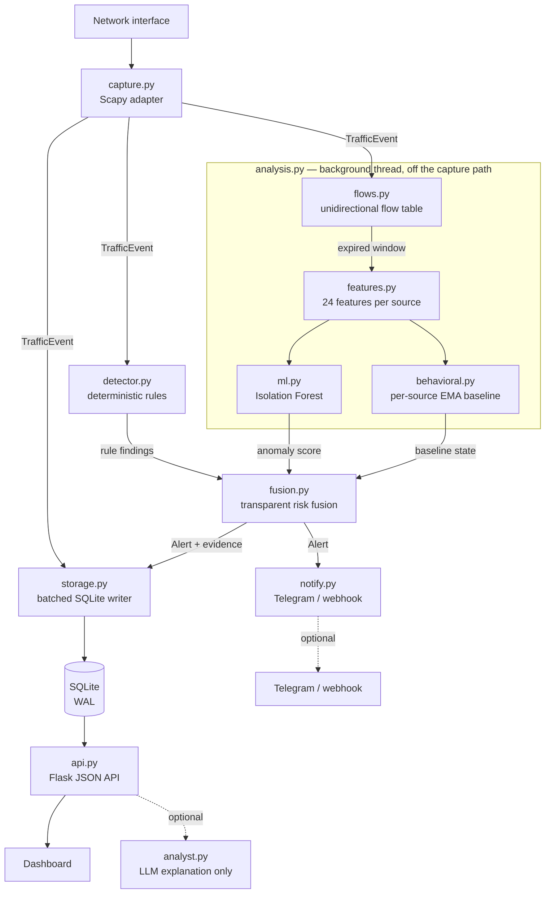

<div align="center">

# NEMOS

**Network Exposure Monitoring & Operations System**

A local-first, explainable network monitoring and intrusion-detection platform
for systems and networks you own or are authorized to monitor.

[](https://github.com/gautam11652-eng/NEMOS/actions/workflows/ci.yml)
[](https://www.python.org/)
[](LICENSE)

</div>

---

## What NEMOS is

NEMOS captures live network traffic, aggregates it into **unidirectional
flows**, and runs three independent detection layers over them: bounded
deterministic rules, a per-source statistical baseline, and an unsupervised
machine-learning anomaly model. Findings are fused into a transparent risk
score, correlated into incidents, and presented in a local SOC dashboard with
the evidence behind every alert.

It runs entirely on one machine. The ML model is trained and executed locally
with scikit-learn; no cloud service, paid API or internet connection is required
for detection. Nothing leaves the machine unless you configure an alert channel.

## What NEMOS is not

This section exists because these distinctions matter more than marketing does.

- **The ML layer detects anomalies, not attacks.** An Isolation Forest reports
  that a traffic window is statistically unlike the traffic it was trained on.
  That is not the same as hostile. Statistical evidence alone is capped below
  CRITICAL and never assigns a MITRE ATT&CK technique.
- **The statistical baseline is not machine learning.** It is an exponentially
  weighted mean and variance per source with an explicit sigma threshold. NEMOS
  keeps the two layers separately labelled, in the data model and in the
  interface, because conflating them would overstate both.
- **An anomaly score is not a probability.** It measures how far a window falls
  into the tail of the training distribution. See [`docs/DETECTION.md`](docs/DETECTION.md).
- **A risk score is not a probability of compromise.** It is analyst triage
  priority, computed from a documented formula you can reproduce by hand.
- **An alert is not proof of an attack.** Detection thresholds are conservative
  by design and false positives are expected. NEMOS is a monitoring tool.
- **The optional LLM analyst performs no detection.** It explains findings the
  other layers already made, and its output is discarded if it references
  anything not present in the evidence.
- **It does not block, contain, or respond.** There is no enforcement path, by
  design. The dashboard never executes containment actions.

## Quick start

Python 3.10 or newer. Packet capture needs Linux with `CAP_NET_RAW`, or Windows
with [Npcap](https://npcap.com) in WinPcap API-compatible mode — the dashboard,
the API and the replay tools run anywhere.

```bash
git clone https://github.com/gautam11652-eng/NEMOS.git
cd NEMOS
python3 -m venv .venv && source .venv/bin/activate
pip install -r requirements.txt
python main.py
```

Open <http://127.0.0.1:5000>. No configuration file to write, no database to
create, no model to download.

To see the detection pipeline without touching a network interface:

```bash
python tools/demo.py            # nine traffic scenarios, generated in memory
```

It transmits nothing and scans nothing.

### Capture on the right interface

Leave `NEMOS_INTERFACE` unset and NEMOS captures on every interface. To pin one,
name it — and name one that exists, which NEMOS will tell you if you do not:

```bash
NEMOS_INTERFACE=eth0 python main.py
```

`eth0` is wrong on a laptop, `wlan0` is wrong on a server, and both are wrong
inside a container, so NEMOS asks the system rather than guessing.

### Capture without running as root

Granting the whole sensor root to read packets gives it every other privilege
too. On Linux, grant only the capability capture actually uses:

```bash
sudo setcap cap_net_raw+eip "$(readlink -f "$(which python3)")"
```

`CAP_NET_RAW` alone is sufficient — measured, not assumed — which is why the
packaged systemd unit grants that and nothing more.


### What the capture state means

| State | Meaning |
| --- | --- |
| `ONLINE` | The socket is bound, packets have arrived, **and none are being lost** |
| `DEGRADED` | Packets are arriving, but the kernel is discarding some of them |
| `NO TRAFFIC` | The socket is bound; nothing has arrived yet |
| `BLOCKED` | The OS refused the capture socket — a privilege problem |
| `NO INTERFACE` | The configured interface does not exist, or none is usable |
| `ERROR` | Anything else, including a missing capture backend |

`ONLINE` is the one that matters, and it has to be earned twice.

It is never set on a successful bind alone: a sensor pointed at the wrong
interface opens its socket perfectly and then sees nothing, and reporting that
as online is exactly how a deployment sits blind for a week. A packet has to
arrive first.

It is also never set while the kernel is throwing traffic away. A capture
socket whose ring buffer overflows keeps delivering packets — just not all of
them — so the packet counter keeps rising and every other signal stays green
while an arbitrary share of the network goes unexamined. NEMOS reads the
socket's own drop counter (`PACKET_STATISTICS` on Linux) and reports
`DEGRADED` above 1% sustained loss, with the count and the percentage on the
Sensor page.

Measured on a real socket: a flood that NEMOS could not drain fast enough
produced **314,238 packets handed to the socket and 145,638 dropped — 46% of
the traffic**. Before this accounting existed, that sensor displayed `ONLINE`
and `all clear`. That is worse than a sensor that fails to start, because
nothing about it invites investigation.

The state is judged on **recent** loss, not the whole run. A sensor that lost
packets while it was still starting has not been unhealthy ever since, and an
alarm that can never clear is one operators learn to ignore — the first version
of this accounting had exactly that bug, pinning a freshly started sensor at
36% on an idle link. The Sensor page shows both: *recent packet loss*, which
drives the state, and the lifetime count, which is history. Verified on a live
sensor: `ONLINE` → `DEGRADED` under a flood → back to `ONLINE` 65 seconds after
it stopped, with 3,618,323 lifetime drops still on record.

Where drops cannot be measured at all — anything that is not Linux AF_PACKET —
the Sensor page says *not measurable on this platform* rather than showing a
reassuring zero, and the state stays `ONLINE` rather than alarming every
non-Linux deployment forever.

Every failure state carries one actionable sentence for the platform you are on,
in the log and on the Sensor page — not a bare "failed" that sends you to a
search engine.

## How it works



Four rules govern this design:

1. **The capture path stays cheap.** Per packet it does one dictionary
   operation under a short lock. Window expiry, feature extraction, batched
   inference and fusion all run on the analysis thread, so inference latency can
   never reach packet capture. Measured on the capture path: 5,000–38,000
   packets/sec depending on window occupancy, and 0.3 ms of inference per
   source-window off it. See [the benchmark](docs/BENCHMARK.md#performance)
   — the range matters more than the peak.
2. **Storage precedes delivery.** An alert is queued for persistence before it
   is queued for notification, so an unreachable Telegram API can never cost a
   recorded detection.
3. **No layer is the sole source of truth.** Deterministic rules set the risk
   floor; statistical layers may raise it but never lower it, and alone they
   cannot reach CRITICAL or name an ATT&CK technique.
4. **An LLM is never in the detection path.** It receives finished evidence and
   returns prose, or NEMOS runs identically without it.

See [`docs/ARCHITECTURE.md`](docs/ARCHITECTURE.md) for module-level detail.

## Does it actually work?

The honest answer, measured rather than asserted.

**Detection quality**, over 20 replays per scenario on the committed defaults:
**recall 100%, precision 58.2%, F1 73.6%** — 160 true positives, 0 false
negatives, 115 false positives across 80 benign replays. Nine of eleven
detections score 100/100/100.

Precision is 58% because the benign corpus is deliberately hard: three of its
four scenarios are *legitimate traffic shaped like an attack* — a NAT gateway, a
metrics poller, a nightly backup. **Those false positives are not tuned away.**
Packet metadata genuinely cannot distinguish authorised bulk transfer from
exfiltration; the honest fix is context, not a threshold that flatters the
number while blinding the detector.

```bash
python tools/benchmark_detection.py      # reproduce it
python tools/replay_pcap.py capture.pcap # or run your own capture through it
```

Backed by **1,060 automated tests** across Python 3.10–3.13, with lint and a
dependency audit on every push.

Full method, the per-detection table, and what it does **not** measure:
[`docs/BENCHMARK.md`](docs/BENCHMARK.md) and
[`docs/PCAP_REPLAY.md`](docs/PCAP_REPLAY.md).

## Alerts

NEMOS records findings locally by default and sends nothing until you configure
a channel. For Telegram, that is one line — set once by whoever deploys the
sensor, never by an operator:

```bash
# .env, beside main.py
TELEGRAM_BOT_TOKEN=the_token_from_@BotFather
```

Then press **Connect Telegram** on the Sensor page and scan the QR code. No
operator is ever asked for a credential or a chat id.

A webhook, a phone notification needing **no credentials at all**, and CEF over
syslog to a SIEM are also supported:
[`docs/ALERTING.md`](docs/ALERTING.md).

## Configuration

Settings come from `.env` beside `main.py`, or the environment. The ones most
deployments touch:

| Setting | Default | What it does |
| --- | --- | --- |
| `NEMOS_INTERFACE` | all | Which interface to capture on |
| `NEMOS_HOST` / `NEMOS_PORT` | `127.0.0.1` / `5000` | Where the dashboard binds |
| `NEMOS_API_TOKEN` | unset | Required for any non-loopback bind |
| `NEMOS_DB` | `data/nemos.db` | Database path |
| `TELEGRAM_BOT_TOKEN` | unset | Enables Telegram alerting |
| `NEMOS_LOG_LEVEL` | `INFO` | Logging verbosity |

Every variable, including the detection thresholds and ML tuning:
[`docs/CONFIGURATION.md`](docs/CONFIGURATION.md).

## Limitations

Stated plainly, because an evaluator will find them anyway:

- **The ML model is only as good as its training data.** It learns what it is
  shown. Train it on traffic that already contains an intrusion and it will
  treat that as normal. There is no supervised attack classifier.
- **Anomalous is not malicious.** A backup job, a new deployment or a software
  update can all be genuinely anomalous and entirely benign.
- The model is trained per deployment. There is no pretrained model shipped,
  because a generic notion of "normal traffic" would not describe your network.
- Encrypted payloads are not inspected. NEMOS reads the TLS *handshake*, which
  is sent in cleartext before a session key exists, to fingerprint the client
  software (JA3) and record the server name. Everything after the handshake is
  ciphertext and is never touched, so nothing encrypted is read and no session
  is decrypted. See [Encrypted traffic](docs/DETECTION.md#encrypted-traffic).
- IPv6 is captured and every rule applies to it, but the volumetric thresholds
  were tuned against IPv4 traffic. A v6 segment with very different host
  density may want them adjusted — see
  [Detection rule tuning](docs/CONFIGURATION.md#detection-rule-tuning). (Until 4.1.0 this section
  claimed v6 was captured when in fact every v6 packet was discarded at the
  parse path; it is genuinely captured now.)
- Single-host. There is no multi-sensor federation or central collector.
- Retention is row-count based, not time based.
- The aggregation window is fixed per deployment and must match the model's
  training window; NEMOS refuses to score across a mismatch rather than
  producing wrong numbers.
- The optional LLM analyst's verification checks IP addresses and technique IDs
  against the evidence. It cannot catch a plausible-but-wrong *sentence* about
  real evidence, only fabricated identifiers.

## Security model

NEMOS is a monitoring tool, not a guarantee of security. Thresholds are
conservative and should be tuned to the monitored environment. False positives
are possible and expected. Keep the host OS, Python runtime and dependencies
patched, and do not expose the application directly to untrusted networks.

### Request limiting

The API applies two independent per-client limits, because the two risks are
different sizes. A general limit (`NEMOS_API_RATE`, 240/min) bounds resource
use; a much tighter one (`NEMOS_API_AUTH_RATE`, 10/min) bounds *rejected*
credentials, since nothing legitimate retries a wrong token. Exceeding either
returns `429` with a `Retry-After` header. `/api/health` is never limited, so a
liveness probe cannot exhaust a client's budget.

Clients are identified by peer address. **`X-Forwarded-For` is deliberately
ignored** — it is attacker-controlled, and honouring it by default would let a
single client mint unlimited identities and bypass the limit entirely. If NEMOS
runs behind a reverse proxy, apply rate limiting at the proxy, where the real
client address is known.

State is per-process and resets on restart. That is appropriate for a single
sensor; it is not a distributed limiter.

Only monitor networks you own or are explicitly authorized to monitor.

## Documentation

| Document | What it covers |
| --- | --- |
| [Architecture](docs/ARCHITECTURE.md) | Module-level design and the rules behind it |
| [Detection](docs/DETECTION.md) | The three layers, fusion, ATT&CK, encrypted traffic |
| [Configuration](docs/CONFIGURATION.md) | Every environment variable |
| [Alerting](docs/ALERTING.md) | Telegram, webhook, syslog, tuning |
| [Benchmark](docs/BENCHMARK.md) | Detection quality and throughput, measured |
| [Capture replay](docs/PCAP_REPLAY.md) | Running real `.pcap` files through the detector |
| [Training](docs/TRAINING.md) | The anomaly model, bootstrap and drift |
| [API](docs/API.md) | The JSON API and the dashboard |
| [Deployment](docs/DEPLOYMENT.md) | systemd, remote access, the installer |
| [Security](SECURITY.md) | Threat model, scope, reporting |
| [Security audit](docs/SECURITY_AUDIT.md) | Standing invariants and how each was verified |
| [Demo notes](docs/DEMO.md) | Running a live demonstration |

## Contributing

See [`CONTRIBUTING.md`](CONTRIBUTING.md). Bug reports and detection-quality
feedback are both welcome — a false positive with the evidence attached is a
useful report.

## License

GPL-2.0-only. See [`LICENSE`](LICENSE) and
[`THIRD_PARTY_LICENSES.md`](THIRD_PARTY_LICENSES.md). Scapy is GPL-2.0-only, so
this project uses a GPL-compatible license.
