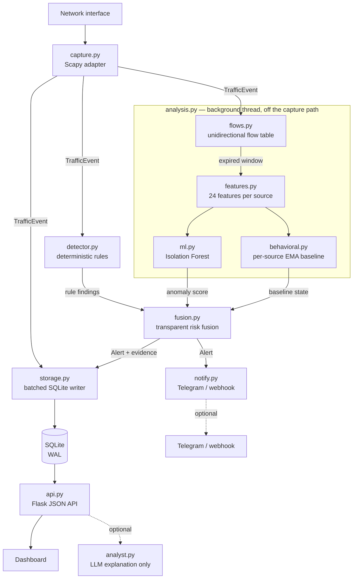

<div align="center">

# NEMOS

**Network Exposure Monitoring & Operations System**

A local-first, explainable network monitoring and intrusion-detection platform
for systems and networks you own or are authorized to monitor.

[](https://github.com/gautam11652-eng/NEMOS/actions/workflows/ci.yml)
[](https://www.python.org/)
[](LICENSE)

</div>

---

## What NEMOS is

NEMOS captures live network traffic, aggregates it into **unidirectional
flows**, and runs three independent detection layers over them: bounded
deterministic rules, a per-source statistical baseline, and an unsupervised
machine-learning anomaly model. Findings are fused into a transparent risk
score, correlated into incidents, and presented in a local SOC dashboard with
the evidence behind every alert.

It runs entirely on one machine. The ML model is trained and executed locally
with scikit-learn; no cloud service, paid API or internet connection is required
for detection. Nothing leaves the machine unless you configure an alert channel.

## What NEMOS is not

This section exists because these distinctions matter more than marketing does.

- **The ML layer detects anomalies, not attacks.** An Isolation Forest reports
  that a traffic window is statistically unlike the traffic it was trained on.
  That is not the same as hostile. Statistical evidence alone is capped below
  CRITICAL and never assigns a MITRE ATT&CK technique.
- **The statistical baseline is not machine learning.** It is an exponentially
  weighted mean and variance per source with an explicit sigma threshold. NEMOS
  keeps the two layers separately labelled, in the data model and in the
  interface, because conflating them would overstate both.
- **An anomaly score is not a probability.** It measures how far a window falls
  into the tail of the training distribution. See [Detection](#detection).
- **A risk score is not a probability of compromise.** It is analyst triage
  priority, computed from a documented formula you can reproduce by hand.
- **An alert is not proof of an attack.** Detection thresholds are conservative
  by design and false positives are expected. NEMOS is a monitoring tool.
- **The optional LLM analyst performs no detection.** It explains findings the
  other layers already made, and its output is discarded if it references
  anything not present in the evidence.
- **It does not block, contain, or respond.** There is no enforcement path, by
  design. The dashboard never executes containment actions.

## Highlights

- Live packet capture via Scapy, with explicit capture-state reporting
- Bounded, stateful detections: TCP SYN scans, UDP port scans, vertical port
  scans, network fan-out, ICMP sweeps and floods, SYN floods, DNS bursts,
  service-connection bursts, and ARP/NDP mapping changes
- **Dual-stack**: IPv4 and IPv6 both reach every rule, with Neighbour Discovery
  classified separately so a healthy v6 segment is not mistaken for a flood
- **Unidirectional flow aggregation** — the five-tuple is used exactly as
  observed, never canonicalised, so a one-way tap is a first-class deployment
- **24 engineered features per source per window**: rates, per-flow statistics,
  TCP flag ratios, protocol ratios, and Shannon entropy over destinations/ports
- **Unsupervised ML anomaly detection** (Isolation Forest, scikit-learn) trained
  locally on your own benign traffic, with an explainable score and the
  contributing features surfaced for every finding
- Per-source statistical baseline with noise floors and multi-feature
  corroboration, so one noisy metric cannot raise an alert alone
- **Transparent hybrid risk fusion** — every score carries the arithmetic that
  produced it
- Incident correlation with stable incident IDs and preserved evidence
- MITRE ATT&CK technique references **only** where the observed behaviour
  supports the mapping; generic anomalies stay explicitly unmapped
- Optional outbound alerting to Telegram, a webhook, or a SIEM as CEF over
  syslog, with a severity floor, per-finding cooldown and rate limiting
- SQLite WAL storage behind a single batched writer thread with bounded,
  priority-aware backpressure
- Optional, evidence-constrained LLM analyst that explains findings and is
  never required for detection
- Loopback-only by default; remote binds require a token
- 1,015 automated tests, CI across Python 3.10–3.13, lint and dependency audit

## Architecture



Four rules govern this design:

1. **The capture path stays cheap.** Per packet it does one dictionary
   operation under a short lock. Window expiry, feature extraction, batched
   inference and fusion all run on the analysis thread, so inference latency can
   never reach packet capture. Measured on the capture path: 5,000–38,000
   packets/sec depending on window occupancy, and 0.3 ms of inference per
   source-window off it. See [Performance](#performance) — the range matters
   more than the peak.
2. **Storage precedes delivery.** An alert is queued for persistence before it
   is queued for notification, so an unreachable Telegram API can never cost a
   recorded detection.
3. **No layer is the sole source of truth.** Deterministic rules set the risk
   floor; statistical layers may raise it but never lower it, and alone they
   cannot reach CRITICAL or name an ATT&CK technique.
4. **An LLM is never in the detection path.** It receives finished evidence and
   returns prose, or NEMOS runs identically without it.

See [`docs/ARCHITECTURE.md`](docs/ARCHITECTURE.md) for module-level detail.

## Requirements

- Python 3.10 or newer
- For packet capture: Linux with `CAP_NET_RAW`, or Windows with
  [Npcap](https://npcap.com) in WinPcap API-compatible mode. The dashboard, the
  API and the replay demo run anywhere.

## Quick start

```bash
git clone https://github.com/gautam11652-eng/NEMOS.git
cd NEMOS
python3 -m venv .venv
source .venv/bin/activate
python -m pip install --upgrade pip
pip install -r requirements.txt
python main.py
```

Open <http://127.0.0.1:5000>.

Leave `NEMOS_INTERFACE` unset and NEMOS captures on every interface. To pin one,
name it — and name one that exists, which NEMOS will tell you if you do not:

```bash
NEMOS_INTERFACE=eth0 python main.py
```

Interfaces are enumerated, never assumed. `eth0` is wrong on a laptop, `wlan0`
is wrong on a server, and both are wrong inside a container, so NEMOS asks the
system rather than guessing — and a name that does not exist is reported as
exactly that, with the list of ones that do.

### What the capture state means

| State | Meaning |
| --- | --- |
| `ONLINE` | The socket is bound **and packets have arrived** |
| `NO TRAFFIC` | The socket is bound; nothing has arrived yet |
| `BLOCKED` | The OS refused the capture socket — a privilege problem |
| `NO INTERFACE` | The configured interface does not exist, or none is usable |
| `ERROR` | Anything else, including a missing capture backend |

`ONLINE` is the one that matters. It is never set on a successful bind alone: a
sensor pointed at the wrong interface opens its socket perfectly and then sees
nothing, and reporting that as online is exactly how a deployment sits blind for
a week. A packet has to arrive first.

Every failure state carries one actionable sentence for the platform you are on,
in the log and on the Sensor page — not a bare "failed" that sends you to a
search engine.

### Capture privileges

Do not run the whole sensor as root to read packets: that grants it every other
privilege too. On Linux, grant the one capability capture actually uses:

```bash
sudo setcap cap_net_raw+eip "$(readlink -f "$(which python3)")"
```

`CAP_NET_RAW` alone is sufficient — measured, not assumed: capture reaches
`ONLINE` as an unprivileged user holding only that capability, which is why
`packaging/systemd/nemos.service` grants only that and nothing more. Most advice
adds `CAP_NET_ADMIN`; NEMOS does not need it.

On Windows, install [Npcap](https://npcap.com) with WinPcap API-compatible mode
enabled. If it is missing, NEMOS says so in one sentence instead of surfacing a
Scapy traceback.

### Try it without capture

To see the detection pipeline end to end without touching a network interface:

```bash
python tools/validate_detection.py
```

This generates synthetic RFC 5737 documentation-address telemetry in memory. It
transmits nothing and scans nothing.

## Configuration

NEMOS reads a `.env` file next to `main.py` at startup. Real environment
variables always take precedence, so a systemd unit or an explicit `export` is
never overridden by a stale file. Copy `.env.example` to `.env` to begin.

### Core

| Variable | Default | Purpose |
| --- | --- | --- |
| `NEMOS_HOST` | `127.0.0.1` | Bind address |
| `NEMOS_PORT` | `5000` | Bind port |
| `NEMOS_INTERFACE` | *(all)* | Capture interface; unset captures on all of them |
| `NEMOS_CAPTURE` | `true` | Enable packet capture |
| `NEMOS_DB` | `data/nemos.db` | SQLite path |
| `NEMOS_API_TOKEN` | *(none)* | Required for any non-loopback bind |
| `NEMOS_API_RATE` | `240` | Requests per client per minute. Must stay above the dashboard's polling (~48/min) |
| `NEMOS_API_AUTH_RATE` | `10` | Rejected credentials per client per minute before 429 |
| `NEMOS_TRUSTED_HOSTS` | *(none)* | Required for wildcard binds |
| `NEMOS_LOG_LEVEL` | `INFO` | Logging level |

### Sensor watchdog

Detects a capture thread that has died without the process exiting — a real
failure mode found on a live deployment, and one `Restart=on-failure` alone
cannot catch. See [Deployment](#deployment).

| Variable | Default | Purpose |
| --- | --- | --- |
| `NEMOS_HEARTBEAT_SECONDS` | `0` (off) | Alert if capture goes this long with no packets. Off by default — a quiet link and a cable pull look identical from packet volume alone |
| `NEMOS_WATCHDOG_POLL_SECONDS` | `15` | How often the watchdog checks capture health and pings systemd |

### Retention and throughput

| Variable | Default | Purpose |
| --- | --- | --- |
| `NEMOS_MAX_TRAFFIC` | `100000` | Traffic rows retained |
| `NEMOS_MAX_ALERTS` | `10000` | Alert rows retained |
| `NEMOS_DB_BATCH` | `250` | Rows per write batch |
| `NEMOS_DB_FLUSH_SECONDS` | `0.5` | Maximum flush interval |
| `NEMOS_DASHBOARD_LIMIT` | `100` | Default dashboard page size |

### Flow analysis and ML

| Variable | Default | Purpose |
| --- | --- | --- |
| `NEMOS_ANALYSIS` | `true` | Enable windowed flow analysis and ML scoring |
| `NEMOS_ANALYSIS_WINDOW` | `10.0` | Aggregation window in seconds — **must match the model's training window** |
| `NEMOS_MAX_FLOWS` | `20000` | Bound on the in-memory flow table |
| `NEMOS_INTERNAL_NETWORKS` | RFC 1918 + loopback | Comma-separated CIDRs treated as internal |
| `NEMOS_MAX_EVENTS` | `1000` | Events retained per source for the rules. Detection cost per packet is linear in this — see [Performance](#performance) |
| `NEMOS_PERSIST_FLOWS` | `true` | Store aggregated flows in SQLite |
| `NEMOS_MODEL_DIR` | `data/model` | Where the trained model is loaded from |
| `NEMOS_ML_AUTOTRAIN` | `true` | Let the sensor train its own model from vetted-normal traffic |
| `NEMOS_ML_BOOTSTRAP_MIN_SAMPLES` | `1000` | Clean windows required before the first fit (floor: 50) |
| `NEMOS_ML_BOOTSTRAP_MIN_SECONDS` | `600` | Observation period required before the first fit |
| `NEMOS_ML_RETRAIN_SECONDS` | `86400` | Refit cadence once a model is active; `0` disables retraining |
| `NEMOS_ML_MAX_SAMPLES` | `20000` | Bound on the stored training corpus |

### Optional LLM analyst

Off unless `NEMOS_LLM_PROVIDER` is set. Nothing is sent anywhere until it is.

| Variable | Default | Purpose |
| --- | --- | --- |
| `NEMOS_LLM_PROVIDER` | *(none)* | `anthropic`, `openai` or `ollama` (local) |
| `NEMOS_LLM_MODEL` | provider default | Model name |
| `NEMOS_LLM_URL` | provider default | Only overridable for `ollama`, and only to a loopback address |
| `NEMOS_LLM_TIMEOUT` | `30` | Request timeout in seconds |
| `ANTHROPIC_API_KEY` / `OPENAI_API_KEY` | *(none)* | Required by the hosted providers |

For a fully offline deployment use `ollama`, which keeps the model on the same
machine. NEMOS refuses to redirect a hosted provider's endpoint, so evidence
about your network cannot be retargeted by a misconfigured variable.

### Baseline tuning

| Variable | Default | Purpose |
| --- | --- | --- |
| `NEMOS_BEHAVIOR_ALPHA` | `0.15` | EMA smoothing factor |
| `NEMOS_BEHAVIOR_MIN_SAMPLES` | `8` | Warm-up before the baseline can alert |
| `NEMOS_BEHAVIOR_SIGMA` | `3.0` | Deviation threshold |
| `NEMOS_BEHAVIOR_SAMPLE_SECONDS` | `5.0` | Sampling cadence |

### Detection rule tuning

Every deterministic-rule threshold is overridable, named `NEMOS_DETECT_<FIELD>`
after the `DetectionConfig` field it sets. The defaults were tuned against
real traffic (including a live nmap sweep and SYN flood, see
[Testing](#testing)) and are the right starting point for most networks; these
exist for the network that genuinely runs hotter or quieter than that. Every
value is clamped on load, so a bad setting cannot silently disable a rule.

| Variable | Default | Purpose |
| --- | --- | --- |
| `NEMOS_DETECT_WINDOW` | `10` | Detection window, seconds |
| `NEMOS_DETECT_PORT_SCAN` | `8` | Distinct ports probed to flag a scan |
| `NEMOS_DETECT_SYN_FLOOD` | `150` | SYNs in the window to flag a flood |
| `NEMOS_DETECT_SYN_FLOOD_CONCENTRATION` | `0.30` | Share of SYNs on one port that separates a flood from a scan |
| `NEMOS_DETECT_ICMP_FLOOD` | `100` | ICMP packets to flag a flood |
| `NEMOS_DETECT_FANOUT` | `25` | Distinct destinations to flag network fan-out |
| `NEMOS_DETECT_DNS_BURST` | `80` | DNS queries to flag a burst |
| `NEMOS_DETECT_SERVICE_BURST` | `40` | Connections to one service to flag a burst |
| `NEMOS_DETECT_UDP_SCAN` | `12` | Distinct UDP ports to flag a scan |
| `NEMOS_DETECT_ICMP_SWEEP` | `12` | Distinct hosts pinged to flag a sweep |
| `NEMOS_DETECT_STEALTH_SCAN` | `6` | FIN/NULL/Xmas packets to flag a stealth scan |
| `NEMOS_DETECT_LATERAL_HOSTS` | `5` | Internal hosts touched to flag lateral movement |
| `NEMOS_DETECT_BRUTE_FORCE` | `20` | Auth attempts to flag brute forcing |
| `NEMOS_DETECT_EXFIL_BYTES` | `25000000` | Outbound bytes to flag exfiltration |
| `NEMOS_DETECT_DNS_TUNNEL_PACKETS` | `30` | DNS packets, combined with mean size, to flag tunneling |
| `NEMOS_DETECT_DNS_TUNNEL_MEAN_SIZE` | `180` | Mean DNS packet size (bytes) that flags tunneling |
| `NEMOS_DETECT_MINING_PACKETS` | `10` | Packets to known mining ports to flag mining |
| `NEMOS_DETECT_TOR_PACKETS` | `10` | Packets to known Tor ports to flag Tor use |
| `NEMOS_DETECT_SPRAY_HOSTS` | `8` | Hosts touched with repeated auth attempts to flag password spraying |
| `NEMOS_DETECT_SPRAY_MAX_ATTEMPTS` | `6` | Attempts per host before it counts toward spraying |
| `NEMOS_DETECT_ICMP_TUNNEL_PACKETS` | `12` | ICMP packets, combined with mean size, to flag tunneling |
| `NEMOS_DETECT_ICMP_TUNNEL_MEAN_SIZE` | `200` | Mean ICMP packet size (bytes) that flags tunneling |
| `NEMOS_DETECT_SERVICE_DOS` | `120` | Packets to one service endpoint to flag denial of service |
| `NEMOS_DETECT_AMPLIFICATION_PACKETS` | `60` | Packets from known amplifier ports to flag reflection abuse |
| `NEMOS_DETECT_INGRESS_BYTES` | `25000000` | Inbound bytes to flag an ingress transfer |
| `NEMOS_DETECT_NONSTANDARD_PACKETS` | `40` | Packets on high, unexpected ports to flag non-standard traffic |
| `NEMOS_DETECT_NONSTANDARD_MIN_PORT` | `10000` | Port floor for the rule above |
| `NEMOS_DETECT_BEACON_MIN_INTERVALS` | `5` | Timing samples required before beaconing can be flagged |
| `NEMOS_DETECT_BEACON_MAX_JITTER` | `0.15` | Maximum timing variance still counted as periodic |
| `NEMOS_DETECT_BEACON_MIN_PERIOD` | `2.0` | Shortest interval (seconds) considered beaconing, not chatter |
| `NEMOS_DETECT_BEACON_HORIZON` | `900.0` | How far back (seconds) beacon timing history is kept |
| `NEMOS_DETECT_SLOW_HORIZON` | `3600.0` | Long-horizon window, seconds, for scans paced below `NEMOS_DETECT_WINDOW` |
| `NEMOS_DETECT_SLOW_SCAN_PORTS` | `40` | Distinct ports on one host over the horizon to flag a slow vertical scan |
| `NEMOS_DETECT_SLOW_SWEEP_HOSTS` | `30` | Hosts on one uncommon port over the horizon to flag a slow sweep |
| `NEMOS_DETECT_SLOW_EVAL_SECONDS` | `30.0` | How often the slow tier is evaluated per source (recording is per packet and O(1)) |
| `NEMOS_DETECT_SLOW_MAX_SOURCES` | `1024` | Sources tracked in the slow tier |
| `NEMOS_DETECT_SLOW_MAX_TRACKED` | `256` | Endpoints remembered per source in the slow tier |
| `NEMOS_DETECT_COOLDOWN` | `30` | Seconds before the same rule can refire for the same source |
| `NEMOS_DETECT_CORRELATION_WINDOW` | `60` | Seconds findings from one source share an incident id |
| `NEMOS_DETECT_MAX_SOURCES` | `4096` | Distinct sources tracked at once, LRU-evicted beyond this |
| `NEMOS_DETECT_BASELINE_MULTIPLIER` | `3.0` | Deviation multiplier for the adaptive-baseline rules |
| `NEMOS_DETECT_BASELINE_MIN_EVENTS` | `20` | Minimum events before the adaptive baseline can flag a source |
| `NEMOS_DETECT_MIN_CONFIDENCE` | `55` | Confidence floor (0-100) below which a finding is dropped |

## Unidirectional traffic

The SIH problem statement concerns **unidirectional IP traffic**, and NEMOS
takes that literally rather than assuming both halves of a conversation are
visible.

A flow is keyed by the five-tuple exactly as observed:

```
(source, destination, source_port, destination_port, protocol)
```

There is no canonicalisation and no address ordering. Traffic from A to B and
traffic from B to A produce **two independent records that are never merged**.
Two reasons:

- A one-way tap, a SPAN port carrying a single direction, or an asymmetric route
  may only ever show one side. A representation assuming both directions would
  silently misreport in exactly that deployment.
- Direction carries the signal. One host contacting two hundred destinations is
  reconnaissance; two hundred hosts answering it is not. Merging the directions
  destroys the asymmetry detection depends on.

**No feature requires a response packet.** Every one of the 24 features is
computed from the observed direction alone — counts, rates, per-flow statistics,
flag ratios, protocol ratios and entropies. Nothing is inferred from traffic
that was never seen, and no feature is silently defaulted to stand in for a
missing reverse flow.

Where reverse traffic *is* available and correlation is wanted,
`FlowTable.reverse_of()` returns the opposite record without modifying or
merging either side. Both directions remain separate rows in the `flows` table
and in `GET /api/flows`.

## Detection

NEMOS runs three independent layers and keeps them distinguishable in the data
model, the API and the interface. They answer different questions:

| Layer | Question it answers | Can name an ATT&CK technique? |
| --- | --- | --- |
| Deterministic rules | Was a specific, named behaviour observed? | Yes |
| Statistical baseline | Is this host behaving unlike *itself*? | No |
| ML anomaly model | Is this window unlike the *trained* traffic? | No |

### Deterministic rules

Bounded, stateful counters over a sliding window produce 27 findings. Each
carries the evidence that triggered it — the ports observed, the SYN ratio, the
destination count — and every finding whose evidence cannot support a stronger
claim says so in its own evidence.

| Stage | Findings |
| --- | --- |
| Reconnaissance | `PORT_SCAN` (external source), `TCP_SYN_SCAN`, `UDP_PORT_SCAN`, `TCP_NULL_SCAN`, `TCP_FIN_SCAN`, `TCP_XMAS_SCAN` |
| Discovery | `PORT_SCAN` (internal source), `NETWORK_FANOUT`, `ICMP_SWEEP`, `SERVICE_CONNECTION_BURST` |
| Credential access | `CREDENTIAL_BRUTE_FORCE`, `PASSWORD_SPRAYING`, `ARP_MAPPING_CHANGE` |
| Lateral movement | `LATERAL_MOVEMENT` (names RDP, SMB, SSH, VNC or WinRM from the observed port) |
| Command and control | `C2_BEACONING`, `DNS_TUNNELING_PATTERN`, `ICMP_TUNNELING_PATTERN`, `TOR_CONNECTION_PATTERN`, `NON_STANDARD_PORT_TRAFFIC`, `INGRESS_TOOL_TRANSFER`, `DNS_BURST` |
| Exfiltration | `DATA_EXFILTRATION_VOLUME`, `DATA_EXFILTRATION_OVER_C2` |
| Impact | `SYN_FLOOD_PATTERN` (requires SYNs concentrated on one service — a port sweep of the same volume is a scan, not a flood), `ICMP_FLOOD_PATTERN`, `SERVICE_DENIAL_OF_SERVICE`, `REFLECTION_AMPLIFICATION`, `CRYPTO_MINING_PATTERN` |

Three of these are worth singling out:

- **`C2_BEACONING`** measures the coefficient of variation of the intervals
  between contacts with one destination. Periodicity is where a unidirectional
  tap is strongest: the callback is visible without ever seeing a reply. Known
  periodic services (NTP, DNS, DHCP) are excluded, because flagging them would
  bury real callbacks in benign noise.
- **`DATA_EXFILTRATION_OVER_C2`** is not a separate signal but a correlation:
  bulk transfer to a host the same source was *already* beaconing to. Two
  findings combining into a stronger claim than either supports alone.
- **`PASSWORD_SPRAYING`** exists because `CREDENTIAL_BRUTE_FORCE` counts per
  target and therefore cannot see it — few attempts each, across many hosts, is
  precisely the shape that evades per-account lockout.

Port-based identifications (mining, Tor, non-standard ports) are heuristics and
are labelled as such in their own evidence, with confidence set accordingly.

On an ordinary (bidirectional) interface NEMOS also sees the replies to your own
connections. Those are recognised and excluded from scan analysis — otherwise
every server that answered several clients would be reported as a port scanner.
Probes are never excluded, so a genuine sweep still fires whatever source port
it comes from.

### Statistical baseline

Each source host gets a profile of four features: packet rate, byte rate, unique
destinations and unique ports. Each is tracked as an exponentially weighted mean
and variance, sampled on a fixed cadence so a rolling window cannot let the
baseline quietly adapt to the burst it is supposed to catch.

Three properties keep this honest:

- **Warm-up.** A profile cannot raise an alert until it has `MIN_SAMPLES`
  observations. A host with no history is never called anomalous.
- **Noise floors.** A zero variance during a stable warm-up cannot turn a
  one-unit change into an effectively infinite z-score.
- **Corroboration.** The strongest deviation must be supported by an independent
  dimension unless it is extreme, so a single noisy feature is not treated as
  hostile.

Baseline state is always one of `NO_BASELINE`, `NORMAL`, `DEVIATING` or
`HIGHLY_DEVIATING`. A host without enough history is `NO_BASELINE` — never
"normal" and never "anomalous", because the evidence supports neither.

**This is a statistical model, not a trained one**, and NEMOS does not call it
AI or ML anywhere.

### Machine-learning anomaly detection

An **Isolation Forest** (scikit-learn) fitted on feature vectors from traffic
you consider benign. It is unsupervised: it is never shown an attack, only what
ordinary traffic on *your* network looks like, and it reports how unusual a
window is relative to that.

**Why Isolation Forest.** The requirement is to flag unusual traffic without
labelled attack data, on a live sensor, explainably. Isolation Forest fits: it
needs no labels, trains in seconds on tens of thousands of windows, scores in
sub-millisecond time per window, has no distance metric to tune, and degrades
gracefully in the moderate dimensionality (24 features) used here. Local Outlier
Factor scores by local density and needs the training set retained at inference,
which is heavier for a long-running sensor. One-Class SVM scales poorly with
sample count and is sensitive to kernel and `nu` choices that are hard to
justify to a reviewer. Both remain reasonable alternatives; the engine is a
single class behind a small interface if you want to substitute one.

**Features** — 24 per source per window, all derivable from observed metadata,
none from payload (TLS handshake fingerprints are recorded as evidence but are
deliberately not model features; see [Encrypted traffic](#encrypted-traffic)):

| Group | Features |
| --- | --- |
| Volume | `packets`, `bytes`, `packets_per_second`, `bytes_per_second` |
| Flow shape | `flow_count`, `mean_flow_duration`, `mean_packets_per_flow`, `mean_bytes_per_flow` |
| Fan-out | `unique_destinations`, `unique_destination_ports`, `unique_source_ports` |
| Dispersion | `destination_entropy`, `destination_port_entropy` |
| Packet size | `mean_packet_size`, `stddev_packet_size`, `small_packet_ratio` |
| TCP flags | `syn_ratio`, `ack_ratio`, `rst_ratio`, `fin_ratio` |
| Protocol mix | `tcp_ratio`, `udp_ratio`, `icmp_ratio`, `dns_ratio` |

Entropy earns its place: it separates "many packets to one destination" from
"many packets spread evenly across destinations", which a unique count cannot.

**The anomaly score (0–100) is not a probability.** `decision_function` returns
an unbounded, scale-free number. At training time NEMOS records that value's
distribution; at inference a window is placed against it in **robust deviation
units**:

```
deviation = (median − raw) / (median − 5th percentile)
```

| Deviation below the training median | Score | Band |
| --- | --- | --- |
| up to 1 unit | 0 | NORMAL |
| 1 – 2 units | 0 – 40 | NORMAL |
| 2 – 2.5 units | 40 – 70 | SUSPICIOUS |
| beyond 2.5 units | 70 – 100 | ANOMALOUS / HIGHLY_ANOMALOUS |

Both anchors are robust by design. An earlier implementation anchored on the
training *minimum* and was wrong in an instructive way: the minimum is a single
sample, so one unusual training window set the whole scale — measured here it
sat at −0.255 against a 5th percentile of −0.030, stretching the band until a
259-port SYN scan scored 65. The bands above come from measured separation on
the bundled scenarios: held-out normal traffic reached 1.7 deviation units,
every abnormal scenario fell between 2.6 and 3.3.

**Explainability.** An Isolation Forest exposes no per-feature attribution, so
NEMOS reports which features are furthest from their training mean, in standard
deviations. A real assessment from the bundled port-scan scenario:

```
anomaly 94/100 (highly anomalous)
  unique destination ports is 317.2 standard deviations above the training mean
  flow count is 288.1 standard deviations above the training mean
  packets per second is 48.5 standard deviations above the training mean
```

**The aggregation window is part of the model contract.** Counts and rates scale
with it, so a model fitted on 10-second windows describes a different
distribution from one applied to 2-second windows. Training records the window;
loading refuses a mismatch rather than producing confident, wrong scores.

### Hybrid risk fusion

The three layers are combined by an explicit, reproducible formula — never
`final = ml_score × 100`.

**When a deterministic rule fired:**

```
risk = strongest rule risk          (the floor)
     + ML contribution              (0–25, scaled above the NORMAL band)
     + baseline contribution        (0, 8 or 15 by state)
     + corroboration bonus          (10 when a statistical layer agrees)
     capped at 100
```

**When no rule fired**, statistics must carry the finding alone, under a
stricter mapping and a lower ceiling:

```
risk = max(ML tail risk, baseline risk)     — max, not sum: the two are usually
     + 10 if both fired                       two views of one underlying change
     capped at 84                            — statistical evidence alone cannot
                                               reach CRITICAL
```

Nothing below the ANOMALOUS band contributes on this path: a merely SUSPICIOUS
window is the ordinary jitter of real traffic, and alerting on it trains
operators to ignore the sensor.

Every assessment carries the arithmetic in its `explanation` object. If you
cannot reproduce the risk score by hand from the signals, that is a bug.
Verdicts are worded for what was observed — `POSSIBLE_RECONNAISSANCE`,
`BEHAVIOR_CONSISTENT_WITH_ATTACK` — never "confirmed attack".

Incidents combine the strongest constituent alert with bounded bonuses for
independent signals; see [`nemos/intelligence.py`](nemos/intelligence.py).

### ATT&CK mapping

A technique ID is attached only where the observed network behaviour supports
it. Scanning maps to `T1046`; DNS tunnelling patterns to `T1071.004`; floods to
`T1498`/`T1498.001`; ARP manipulation to `T1557.002`. A generic behavioural
anomaly is reported as an unmapped signal with a stated reason, rather than
being assigned a technique it does not evidence.

## Encrypted traffic

Most traffic worth watching is now inside TLS, which is the blind spot every
metadata-only sensor has: NEMOS can see that a host opened a session and how
much crossed it, but not what was said.

The handshake is the exception. Before a session key exists, client and server
negotiate in cleartext — which versions, ciphers, extensions and curves they
support. That negotiation is a property of the *software*, not of the user, and
it is distinctive: Chrome, curl, python-requests, Go's `crypto/tls` and a
Cobalt Strike beacon all present recognisably different handshakes. **JA3** is
the standard hash of that negotiation, and NEMOS computes it for every
handshake it sees, in both directions (JA3S for the server).

**What is read, precisely.** The ClientHello and ServerHello, and nothing else.
Application data — everything after the handshake — is ciphertext and is never
parsed. NEMOS does not decrypt, does not proxy, and does not need a private
key. The one field that identifies a destination rather than software is the
SNI (the hostname the client asks for), which is recorded because it is the
field that makes a finding actionable.

**GREASE is stripped.** RFC 8701 has clients inject reserved values into their
cipher and extension lists specifically so middleboxes cannot assume the lists
are fixed, and Chrome picks different ones on every connection. Hashing the
lists as they arrive gives a browser a brand-new fingerprint per connection,
which makes JA3 worse than useless. NEMOS removes them before hashing, so a
fingerprint is stable across connections from the same software.

### What this detects, and what it does not

| Finding | Technique | What it means |
| --- | --- | --- |
| `TLS_ON_UNEXPECTED_PORT` | T1571 | Confirmed TLS handshakes to an external host on a port that is not a TLS port. Because the handshake is unmistakable, this knows the traffic really is TLS rather than guessing from the port number. |

Fingerprints are also attached as **evidence** to every command-and-control
finding, which is the larger practical win: a beaconing alert that carries a
JA3 can be pivoted on — across this network, across other tooling, across
public corpora — where "talked to 203.0.113.9" leads nowhere.

**NEMOS ships no list of known-malicious JA3 hashes, on purpose.** Such lists
go stale quickly, collide with common libraries (a great deal of malware uses
stock Go or Python TLS, and so does a great deal of legitimate software), and
shipping one would claim a detection quality that cannot be validated here.
The fingerprint is recorded so *you* can pivot on it; it is never treated as a
verdict.

**Fingerprint diversity is evidence, never its own alert.** A workstation
speaks TLS with a small, stable set of client software, so a host presenting
many distinct handshakes is worth an analyst's attention. But behind NAT one
address aggregates every host behind it and reaches any threshold honestly, so
this could not earn a standalone confidence. It appears in evidence, with that
caveat stated inline, and strengthens a finding rather than making one.

### Configuration

| Variable | Default | Purpose |
| --- | --- | --- |
| `NEMOS_DETECT_TLS_HORIZON` | `900` | How long a fingerprint stays associated with a source, in seconds |
| `NEMOS_DETECT_TLS_MAX_FINGERPRINTS` | `6` | Distinct fingerprints from one address before diversity is noted in evidence |
| `NEMOS_DETECT_TLS_ODD_PORT_HANDSHAKES` | `3` | Handshakes on a non-TLS port before it is reported |
| `NEMOS_DETECT_TLS_MAX_TRACKED` | `16` | Bound on fingerprints, names and ports retained per source |

## Training the model

You do not have to. Start NEMOS, point it at authorized traffic, and it trains
its own model. The manual command below still works and is still the right tool
for training from a specific captured period.

### Automatic bootstrap (default)

A sensor with no model starts normally and reports `WARMING_UP`. Deterministic
rules and the statistical baseline run exactly as they always did — the model
is the third layer, not the load-bearing one.

While it warms up, NEMOS collects feature windows for its training corpus, and
this is the part that matters:

**It only keeps windows every detection layer judged unremarkable.** A window
enters the corpus when the fused assessment for that source came back
`NO_FINDING`: no deterministic rule fired, the statistical baseline is not
deviating, and any model already loaded scored it in the NORMAL band. There is
no second detection implementation involved — the filter reads the existing
one. A source is additionally held out for a few windows after any rule
finding, because a detection raised late in a window is fused into the next
one. So a sensor bootstrapping through a port scan does not learn that port
scanning is normal; it learns from the windows around it and excludes the scan.

**It will not train on volume alone.** A sample count is satisfied by one quiet
minute repeated, which teaches an Isolation Forest nothing and lets genuinely
unusual traffic land inside its notion of normal. Both
`NEMOS_ML_BOOTSTRAP_MIN_SAMPLES` and `NEMOS_ML_BOOTSTRAP_MIN_SECONDS` must be
satisfied, on top of the distinct-row floor training enforces anyway.

When both hold, NEMOS fits a model **on a background thread** — packet capture
and the analysis loop are never blocked — validates it against the live feature
contract (schema version, feature names, and the aggregation window), promotes
it with an atomic file replacement and activates it. The Sensor page shows the
state throughout.

The corpus lives in the sensor's own SQLite database, so restarting resumes
from the samples already collected rather than beginning the observation period
again.

Once a model is active, NEMOS refits it every `NEMOS_ML_RETRAIN_SECONDS` from
newly collected clean traffic. This is a *bounded* refit on a vetted corpus, not
continuous online learning: **the active model keeps scoring the whole time, and
a replacement is only promoted after it validates.** If a refit fails for any
reason, the working model is untouched and the sensor says so.

Set `NEMOS_ML_AUTOTRAIN=false` to keep training a manual operation.

### The honest limits of this

Automatic training narrows a real gap — before it, most deployments simply never
had a model — but it is not a free upgrade:

- A network that is already compromised when NEMOS is first deployed can have
  that compromise represented in its idea of normal, if the traffic is steady
  enough that no rule and no baseline ever flags it. Vetting excludes what NEMOS
  *detects*; it cannot exclude what NEMOS never noticed.
- Retraining follows a network as it changes, which is the point, and also means
  a slow enough change is followed rather than flagged. The daily default is a
  deliberate trade; `NEMOS_ML_RETRAIN_SECONDS=0` opts out.
- It is bootstrapping, not self-supervision. Nothing here evaluates whether the
  resulting model is *good* — no accuracy, precision or recall is computed or
  claimed, because nothing labelled exists to compute them against.

### From your own captured traffic (recommended)

Run NEMOS with capture enabled for a representative period — ideally a full
daily cycle — that you are reasonably confident is clean. Then:

```bash
python tools/train_model.py --source database --window 10
```

The model learns *your* network's normal, not a generic idea of normal.

Inspect the data before fitting anything to it:

```bash
python tools/train_model.py --source database --dry-run
```

### From synthetic traffic (evaluation and demo)

```bash
python tools/train_model.py --source synthetic --window 10
```

This generates RFC 5737 documentation traffic in memory. It proves the pipeline
works; it says nothing about your network, and the tool says so on completion.

### Knowing when to retrain

A model trained once and never revisited fails silently in both directions:
traffic drifts away from what it learned and ordinary work starts scoring
anomalous, or the network grows into what it considers normal and it stops
flagging what it should. Neither raises an error.

`/api/status` reports three independent signals under
`analysis.model.health`:

| Signal | Meaning |
| --- | --- |
| `age_days` / `stale` | Time since training. Reported separately from any verdict, because age alone is not evidence — a model on a stable network stays valid far longer than the 90-day mark that raises `stale`. |
| `drifted` / `drifted_features` | Each feature's live mean against its training mean, in training standard deviations. A feature 4+ sigmas out is named with its numbers; the model is only called drifted once ~a third of features have moved, since one moved feature is a changed service rather than a changed network. |
| `score_inflated` / `anomalous_fraction` | Share of windows in the anomalous bands. If most windows are anomalous, a stale calibration is the likelier explanation than a network under continuous attack. |

`drift_comparable` reports whether the comparison could run at all, so a
check that could not execute is never mistaken for one that passed.

None of these assert the model is wrong. They are the evidence for deciding
whether to retrain, and the report names which signal fired.

### Model lifecycle

- **Persistence** — model and calibration are written atomically to
  `data/model/`, with metadata recording the feature schema, feature names,
  aggregation window, sample count, scikit-learn version, seed and timestamp.
- **Loading** — automatic at startup. `GET /api/analysis` reports model state,
  version, training provenance and windows scored.
- **Reproducibility** — a fixed seed means two training runs over the same data
  produce identical scores.
- **Retraining** — rerun the command; the next start picks the new model up.
- **Refusal, not silence.** Training is refused for fewer than 50 windows, fewer
  than 20 *distinct* windows (repeated identical windows teach nothing and
  produce a model that scores real anomalies as normal), or a corpus mixing
  aggregation windows. Loading is refused on a schema, feature-name or window
  mismatch. Every refusal names the fix.
- **Absence is not failure.** No model, a corrupt model, or scikit-learn not
  installed leaves NEMOS running on deterministic rules plus the statistical
  baseline, with the reason reported in the API and on the dashboard.

## Demonstration

A controlled, offline demonstration of the whole pipeline across nine traffic
scenarios:

```bash
python tools/demo.py                        # all scenarios
python tools/demo.py --scenario port_sweep  # one
python tools/demo.py --no-train             # the rules-only degraded path
```

Everything is generated in memory using RFC 5737 documentation addresses. No
packet is transmitted, no interface is touched, no host is contacted. The
scenarios are traffic *shapes*, not exploits.

Scenarios: normal traffic, connection burst, destination fan-out, port sweep,
abnormal TCP (SYN flood pattern), unusual UDP, DNS deviation, sudden rate
deviation, ICMP sweep.

Results from the bundled run — normal traffic produces no finding, and every
abnormal scenario is detected:

| Scenario | Flows | Rules | Anomaly | Risk | Verdict |
| --- | --- | --- | --- | --- | --- |
| normal_traffic | 189 | 0 | – | 0 | NO_FINDING |
| connection_burst | 396 | 2 | 100 | 100 | POSSIBLE_RECONNAISSANCE |
| destination_fanout | 199 | 3 | 91 | 100 | POSSIBLE_RECONNAISSANCE |
| port_sweep | 259 | 3 | 94 | 100 | POSSIBLE_RECONNAISSANCE |
| abnormal_tcp | 621 | 2 | 100 | 100 | POSSIBLE_RECONNAISSANCE |
| unusual_udp | 119 | 2 | 100 | 100 | POSSIBLE_RECONNAISSANCE |
| dns_deviation | 300 | 1 | 100 | 100 | BEHAVIOR_CONSISTENT_WITH_ATTACK |
| rate_deviation | 1239 | 2 | 84 | 100 | POSSIBLE_RECONNAISSANCE |
| icmp_sweep | 119 | 3 | 100 | 100 | POSSIBLE_RECONNAISSANCE |

## Detection benchmark

Throughput is not detection quality. `tools/benchmark.py` answers "how many
packets per second"; this answers the question that decides whether a detector
is worth deploying:

```bash
python tools/benchmark_detection.py
python tools/benchmark_detection.py --repeats 20 --json results.json
```

Every scenario in `tools/scenarios.py` carries machine-readable ground truth
(`Scenario.expected`) decided from the **traffic shape**, independently of what
NEMOS emits. That independence is the point — labelling scenarios with whatever
the detector already finds would make recall 1.0 by construction.

### Results

20 replays per scenario, each with a different seed, on the committed defaults
(10s window, confidence floor 55). Reproduce with the command above.

| Detection | Precision | Recall | F1 | FP on benign |
| --- | ---: | ---: | ---: | ---: |
| PORT_SCAN | 100% | 100% | 100% | 0 |
| TCP_SYN_SCAN | 100% | 100% | 100% | 0 |
| UDP_PORT_SCAN | 100% | 100% | 100% | 0 |
| ICMP_SWEEP | 100% | 100% | 100% | 0 |
| ICMP_FLOOD_PATTERN | 100% | 100% | 100% | 0 |
| DNS_BURST | 100% | 100% | 100% | 0 |
| SYN_FLOOD_PATTERN | 100% | 100% | 100% | 0 |
| SERVICE_CONNECTION_BURST | 100% | 100% | 100% | 0 |
| BEHAVIORAL_TRAFFIC_ANOMALY | 100% | 100% | 100% | 0 |
| SERVICE_DENIAL_OF_SERVICE | 66.7% | 100% | 80% | 20 |
| NETWORK_FANOUT | 33.3% | 100% | 50% | 40 |

**Overall: recall 100%, precision 58.2%, F1 73.6%** — 160 true positives, 0
false negatives, 115 false positives across 80 benign replays (1.44 per
replay). Median detection latency **1.20s** of scenario time.

### The false positives are real, and not tuned away

Recall is 100% because the attack scenarios are unambiguous. Precision is 58%
because the benign corpus is deliberately hard: three of the four benign
scenarios are *legitimate traffic shaped like an attack*, which is where real
false positives come from.

| Benign scenario | What NEMOS says | Why |
| --- | --- | --- |
| `nat_gateway` | NETWORK_FANOUT, PASSWORD_SPRAYING | One address speaking for a whole office contacts many destinations on many ports. Indistinguishable from a scan without knowing it is a gateway |
| `monitoring_host` | NETWORK_FANOUT | A metrics poller contacting 39 hosts on a schedule is shaped exactly like discovery |
| `backup_window` | C2_BEACONING, CREDENTIAL_BRUTE_FORCE, SERVICE_DENIAL_OF_SERVICE | A nightly bulk transfer to an SMB server looks like exfiltration, brute force and a flood at once |

These are **not** bugs to be fixed by raising thresholds. Each is a case where
packet metadata genuinely does not carry the distinguishing information — the
difference is authorisation and role, which no amount of header inspection
reveals. The honest fix is context (an asset inventory that knows which address
is the gateway, the poller and the backup target), not a threshold that makes
the number look better while blinding the detector to the real version of the
same shape.

An earlier version of this benchmark measured only against `normal_traffic`,
which is *paced below the detector's thresholds by construction*, and reported
100% precision with zero false positives. That figure was close to circular and
has been removed rather than quoted.

### What it does not measure

- **The ML model.** These figures are the deterministic rules only. Nothing
  here evaluates the Isolation Forest; see the note under Training.
- **Real network traffic.** The corpus is synthetic. It exercises the shapes the
  rules target, not the messiness of a production network.
- **Evasion.** Nothing here is paced to slip under a window deliberately; see
  `nemos/slowscan.py` for the tier that addresses that, which this does not
  score.

## Alert delivery

NEMOS records findings locally by default. It can also push them to Telegram or
a webhook. Delivery is off until you configure a channel, and it never blocks
packet capture.

### Connecting a chat: scan a QR code

A bot token is a *deployment* secret. One NEMOS install needs exactly one, set
once by whoever deploys it, and no operator should ever be asked to paste one
into a web form. So they are not: they scan a QR code.

```bash
# .env, beside main.py -- one setting, set once, by the deployment
TELEGRAM_BOT_TOKEN=the_token_from_@BotFather
```

That is the whole configuration. `TELEGRAM_BOT_USERNAME` is optional: the token
already determines the username, so NEMOS asks Telegram once and caches the
answer rather than making you look it up and retype it — which was not just
extra work but the one setting whose typo failed *silently*, rendering a
perfectly valid QR code that pointed at a bot which did not exist.

The bot token cannot be eliminated. Telegram has no anonymous send path — a
token *is* the bot's identity. What NEMOS removes is everyone else having to
handle one: it is set once by whoever deploys the sensor, stays server-side, and
no operator is ever asked for a credential or a chat id.

Then, on the **Sensor** page, press **Connect Telegram**. NEMOS mints a single-use
pairing code, renders `https://t.me/<bot>?start=<code>` as a QR code, and counts
down its five-minute life. Scan it, press **Start**, and that chat is linked.
Alerts begin arriving immediately — no restart, no chat id to look up.

What the pairing code has to survive, and how:

| Attack | Defence |
| --- | --- |
| Guessing a code | 128 bits from `secrets.token_urlsafe` |
| Replaying a used code | Redemption flips `used` inside one `BEGIN IMMEDIATE` transaction, so concurrent `/start`s cannot both win |
| Waiting out and then using an expired code | Expiry is compared against the server clock at redemption; nothing the client sends is consulted |
| Linking someone else's chat | A code binds whichever chat redeems it and is then dead |
| Injecting a chat id | The chat id comes only from Telegram's own update payload, and must still parse as one |
| Reading codes out of a stolen database | Only SHA-256 hashes are stored, and a hash cannot be replayed as a start parameter |

Issuing a new code retires the previous one, so a link screenshotted an hour ago
is not still live alongside the one on screen.

The QR encoder is `nemos/qr.py` — about 400 lines, no new dependency. Its output
is pinned in the test suite against an independent reference implementation, and
the rendered SVG has been decoded back to the exact pairing link.

`python tools/connect_telegram.py` still works and still writes
`TELEGRAM_CHAT_ID`; QR pairing is the path that does not require shell access to
the sensor.

### What an alert looks like

Detail scales with severity, because a channel that sends the same wall of text
for everything trains its reader to ignore it. LOW is two lines. CRITICAL is the
full structured report:

```
🚨 NEMOS SECURITY INCIDENT
━━━━━━━━━━━━━━━━━━

Severity: HIGH

Detection:
PORT_SCAN

Confidence: 99%
Risk score: 89/100

Source:
192.0.2.10

Why this fired:
8 unique destination ports in 10s

Observed:
• 8 packets
• 1 unique destination
• 8 unique ports

Evidence:
• scan type: vertical
• ports: 8 — 20, 21, 22, 23, 24, 25, ...
• syn ratio: 1.0

ATT&CK:
T1595 — Active Scanning
Tactic: Reconnaissance

Incident: NEMOS-B956BF9FC040
Observed at: 2026-09-03T04:11:06+00:00

[ Investigate ] [ Acknowledge ] [ Open Dashboard ]
```

Every value there came out of the finding. A field NEMOS does not have produces
no line — not a blank, not a zero. Evidence lists are summarised rather than
dumped: a port scan legitimately carries a hundred port numbers, and sending all
of them helps nobody.

Messages are plain text with **no parse mode**. Alert fields carry
attacker-influenced content, and asking a chat client to parse that as Markdown
invites both delivery failures and formatting injection. Newlines are stripped
from every field so nothing can forge a second section.

### Commands

A linked chat can ask:

| Command | Answers with |
| --- | --- |
| `/status` | Capture, detection, ML, database and delivery state, plus live counters |
| `/incidents` | The most recent incidents, highest risk first |
| `/critical` | Only incidents carrying a critical finding |
| `/hosts` | Observed hosts ranked by risk |
| `/incident <id>` | One incident with its evidence timeline and ATT&CK mapping |
| `/brief` | The security summary on demand |

An unlinked chat gets pairing instructions and nothing else — not a count, not a
host, not an incident id. Authorisation is re-checked when an inline button is
pressed, so a chat unlinked after an alert was sent cannot still act on it.
Every state-changing action is recorded in an audit log with its actor, target,
result and timestamp, readable at `/api/telegram/audit`.

Set `NEMOS_TELEGRAM_BRIEF_HOUR` to send a daily summary at that UTC hour.

### Verifying delivery

NEMOS tests the delivery path against a mock Bot API, and the whole chain has
been exercised end to end against the live one -- live capture through to a
message arriving in a real chat. What it cannot test is *your* token and chat
id. Run:

```bash
python tools/verify_telegram.py
```

It sends one clearly-labelled test message and, on failure, names the likely
cause -- wrong token, unreachable chat, bot blocked, bot never started, missing
post rights, or no route to api.telegram.org. Credentials are read from the
environment or `.env`, never from arguments, and never printed.

### Telegram

1. Open Telegram and start a chat with **@BotFather**.
2. Create a bot with `/newbot` and copy the token. You do not need the username.
3. Add both to `.env` — this is the only Telegram configuration a deployment needs:

```env
TELEGRAM_BOT_TOKEN=your_bot_token
```

4. Open the **Sensor** page and press **Connect Telegram**, then scan the QR code.

`TELEGRAM_CHAT_ID` remains supported for a single fixed recipient, but is no
longer required: paired chats are the delivery audience.

### Phone alerts with no credentials at all

A Telegram bot token cannot be avoided — a token *is* the bot's identity, and
Telegram has no unauthenticated send path. If you want alerts on a phone and are
not willing to hold any credential, use a push service instead:

```env
NEMOS_WEBHOOK_URL=https://ntfy.sh/pick-something-long-and-unguessable
NEMOS_WEBHOOK_FORMAT=text
```

That is the entire configuration. No token, no chat id, no account, no signup.
Install the ntfy app, subscribe to that topic, and findings arrive as push
notifications carrying the same rendered report Telegram gets — severity,
evidence, ATT&CK technique, incident id — with the severity also set as the
notification's priority and tag.

What you give up, stated plainly:

| | Telegram | `text` webhook |
| --- | --- | --- |
| Credential to hold | one bot token, set once | **none** |
| Report format | full structured report | the same report |
| Inline actions (Investigate / Acknowledge) | yes | no |
| Commands (`/status`, `/incidents`, …) | yes | no |
| Who can read your alerts | only paired chats | **anyone who guesses the URL** |

That last row is the real cost. The topic name is the only thing protecting the
feed, so treat it as a password: long, random, never committed. A short or
guessable topic publishes your network's security findings to whoever tries it.

### Webhook

```env
NEMOS_WEBHOOK_URL=https://your-collector.example/hook
NEMOS_WEBHOOK_TOKEN=optional_bearer_token
NEMOS_WEBHOOK_FORMAT=json
```

The URL must be HTTPS unless it points at loopback: alert bodies describe your
network and are not sent in cleartext. Redirects are refused rather than
followed, so a redirect cannot downgrade the transport or retarget the payload.

### Syslog / SIEM

Findings can be exported as **CEF over RFC 5424 syslog**, the format Splunk,
QRadar, Elastic and Wazuh parse without a custom decoder — so NEMOS can be a
component of an existing detection stack rather than a second console nobody
watches.

```env
NEMOS_SYSLOG_HOST=10.0.0.9
NEMOS_SYSLOG_PORT=514
NEMOS_SYSLOG_PROTOCOL=udp      # or tcp
NEMOS_SYSLOG_FACILITY=13
```

A finding arrives looking like this:

```
<107>1 2026-01-01T00:00:00+00:00 sensor NEMOS - PORT_SCAN - CEF:0|NEMOS|NEMOS|4.1.0|PORT_SCAN|PORT_SCAN|7|src=203.0.113.9 dst=192.168.1.10 dpt=443 proto=TCP cn1=74 cn1Label=riskScore cs1=T1595 cs1Label=mitreTechnique cs2=NEMOS-ABC123 cs2Label=incidentId msg=20 distinct ports probed in 10s
```

UDP is the default because it cannot block delivery on an unreachable
collector; TCP is available where the collector requires it and losses matter
more than latency.

Every field is escaped before it is written. This is a security boundary, not
formatting: alert fields quote evidence, evidence quotes the network, and a
raw newline reaching a collector would let an attacker end the record and
forge a second one after it — putting adversary-controlled text into a record
a responder trusts. Newlines, pipes and equals signs are escaped, and a test
asserts a forged `CEF:0|Evil|...|All clear` inside a finding stays inside the
`msg=` field instead of becoming its own event.

### Tuning what gets sent

| Variable | Default | Purpose |
| --- | --- | --- |
| `NEMOS_NOTIFY` | `true` | Master switch |
| `NEMOS_NOTIFY_MIN_SEVERITY` | `HIGH` | `LOW`, `MEDIUM`, `HIGH`, `CRITICAL` |
| `NEMOS_NOTIFY_COOLDOWN` | `300` | Seconds before the same finding repeats |
| `NEMOS_NOTIFY_RATE` | `12` | Maximum messages per minute |
| `NEMOS_NOTIFY_TIMEOUT` | `5.0` | Per-request timeout |
| `NEMOS_NOTIFY_QUEUE` | `256` | Pending-delivery queue size |
| `NEMOS_WEBHOOK_FORMAT` | `json` | `text` posts the rendered report for push services |
| `TELEGRAM_BOT_TOKEN` | — | Deployment bot credential; never leaves the server |
| `TELEGRAM_BOT_USERNAME` | *(derived)* | Optional; resolved from the token via getMe when unset |
| `TELEGRAM_CHAT_ID` | — | Legacy fixed recipient; QR pairing replaces it |
| `NEMOS_DASHBOARD_URL` | — | Base URL alerts link back to; `https://` for a button |
| `NEMOS_TELEGRAM_BRIEF_HOUR` | — | UTC hour for the daily brief; unset is off |
| `NEMOS_TELEGRAM_CONTAIN_HOOK` | — | Lab-only containment executable (see below) |

The cooldown and rate limit exist so a port scan cannot turn the sensor into a
message flood. **Suppressed alerts are still recorded and still appear on the
dashboard** — only the outbound copy is dropped, and every suppression is
counted in `/api/notifications`.

The bot token is never returned by any endpoint and is redacted from logs and
error messages. A test asserts this against every Telegram route, against
`/api/status`, and against the rendered page.

### Containment

NEMOS is a passive sensor. It has no enforcement point, so it does not pretend
to have one: there is no built-in "block this host". Where a controlled lab has
a real containment action, point `NEMOS_TELEGRAM_CONTAIN_HOOK` at an executable
and a **Contain** button appears on alerts. Pressing it runs that executable
with the incident id as its only argument — argv form, no shell, a 20-second
timeout, and the id validated against the `NEMOS-<12 hex>` format NEMOS itself
mints, so nothing typed in a chat can become a command. Every attempt is
audited, and the button is absent unless the hook is configured.

## API

| Endpoint | Purpose |
| --- | --- |
| `GET /api/health` | Liveness (public even when a token is set) |
| `GET /api/dashboard` | Consolidated dashboard snapshot (ETag-cached) |
| `GET /api/stats` | Telemetry counters |
| `GET /api/alerts` | Recent alerts, filterable |
| `GET /api/alerts/<id>` | Single alert with evidence |
| `GET /api/incidents` | Correlated incidents |
| `GET /api/incidents/<incident_id>` | Incident detail and triage summary |
| `GET /api/telegram/pair` | Pairing state and linked chats (never the code) |
| `POST /api/telegram/pair` | Mint a single-use pairing code and its QR code |
| `DELETE /api/telegram/pair` | Revoke the outstanding pairing code |
| `DELETE /api/telegram/links/<chat_id>` | Unlink a paired chat |
| `POST /api/telegram/test` | Send the confirmation message to paired chats |
| `GET /api/telegram/audit` | Audit trail for chat-initiated actions |
| `GET /api/hosts` | Host risk index |
| `GET /api/hosts/<ip>` | Per-host investigation view |
| `GET /api/techniques` | ATT&CK catalog with observed counts |
| `GET /api/flows` | Unidirectional flows; `active=true` for the live table |
| `GET /api/analysis` | Windowed-analysis and ML model health |
| `GET /api/anomalies` | Recent fused assessments with full arithmetic |
| `GET /api/windows` | Recent completed analysis windows |
| `GET /api/baselines`, `GET /api/baselines/<ip>` | Per-host baseline state |
| `GET /api/analyst` | Optional LLM analyst status |
| `POST /api/analyst/ask` | Ask the analyst about an incident or host |
| `GET /api/traffic` | Recent traffic events |
| `GET /api/status` | Capture, writer and delivery health |
| `GET /api/metrics` | Writer and delivery metrics |
| `GET /api/notifications` | Alert-delivery configuration and health |
| `POST /api/packet` | Test/compatibility ingestion |
| `POST /api/alerts/<id>/ack` | Acknowledge an alert |
| `POST /api/alerts/clear` | Clear alerts |

### Filtering alerts

`GET /api/alerts` accepts `severity` (repeatable), `source`, `threat`,
`technique`, `acknowledged`, `since` and `limit`:

```bash
curl 'http://127.0.0.1:5000/api/alerts?severity=CRITICAL&severity=HIGH&acknowledged=false'
curl 'http://127.0.0.1:5000/api/alerts?source=192.0.2.10&since=2026-01-01'
```

Every filter is validated and passed as a bound parameter.

`GET /api/flows` accepts `source`, `destination`, `protocol`, `limit` and
`active`. Both directions of a conversation appear as separate rows:

```bash
curl 'http://127.0.0.1:5000/api/flows?source=192.0.2.10'
curl 'http://127.0.0.1:5000/api/flows?active=true'
```

`POST /api/analyst/ask` takes a **target**, never evidence — NEMOS assembles the
bundle from its own storage, so the endpoint cannot be used as a general-purpose
LLM proxy:

```bash
curl -X POST http://127.0.0.1:5000/api/analyst/ask \
  -H 'Content-Type: application/json' \
  -d '{"question":"why is this host suspicious?","host":"192.0.2.10"}'
```

When `NEMOS_API_TOKEN` is set, all `/api/*` endpoints except `/api/health`
require an `X-NEMOS-Token` header. The dashboard prompts for the token and keeps
it in `sessionStorage` only.

## Dashboard

A local SOC interface with a live detection timeline, security posture summary,
correlated-incident investigation with evidence and recommended next steps, a
host risk index, an ATT&CK coverage view, a connection graph, and sensor health
including capture state and writer backpressure.

The **ML Detection** section shows:

- **Model status** — loaded or not trained, version, training timestamp,
  training window count, windows scored, aggregation window
- **Per-assessment detail** — anomaly score, confidence, risk, baseline state
- **Hybrid verdict** — the fusion arithmetic, the layers that contributed, and
  the ATT&CK techniques (or an explicit note that statistical evidence does not
  name one)
- **Why this was flagged** — the contributing features and their deviations

Every displayed value maps to a real backend field; a test enforces that and
forbids overstated wording such as "AI detected attack".

## Testing

```bash
pip install -r requirements-dev.txt
python -m pytest -q                              # 1,015 tests
python -m compileall -q main.py nemos tests      # syntax
ruff check .                                     # lint
python -m pip_audit -r requirements.txt          # dependency audit
```

`make test`, `make compile`, `make audit` and `make demo` wrap the common ones.
CI runs the suite on Python 3.10–3.13 plus lint, dependency audit and a package
build on every push and pull request.

For a full environment check on Kali or another Debian-based host:

```bash
./scripts/verify-kali.sh
```

## Deployment

Run capture with the minimum capability rather than as root. From the project
root on a Debian-based host:

```bash
sudo ./install.sh
```

This creates the `nemos` service account, installs pinned dependencies into
`/opt/nemos/.venv`, creates `/var/lib/nemos` for the database, installs the
systemd unit and starts it. Configuration lives at `/etc/nemos/nemos.env`, and
the dashboard stays local-only at `http://127.0.0.1:5000` by default.

```bash
sudo systemctl status nemos
sudo journalctl -u nemos -f
```

The unit grants `CAP_NET_RAW` only and keeps the application process
unprivileged, while permitting the `AF_PACKET` and `AF_NETLINK` socket families
Scapy needs. See [`docs/DEPLOYMENT.md`](docs/DEPLOYMENT.md) for the manual
layout and for the post-install smoke test.

The unit also sets `WatchdogSec=90`. NEMOS pings systemd itself
(`nemos/watchdog.py`) whenever packet capture is healthy and stops the moment
it is not, so a capture thread that dies without the process exiting still
gets the process restarted — `Restart=on-failure` alone only helps a process
that actually exits. This was found as a real gap: on a live deployment the
dashboard kept answering while capture underneath it had already died.

### Remote access

Do not bind to `0.0.0.0` casually. If you need a remote listener:

```bash
export NEMOS_HOST=0.0.0.0
export NEMOS_API_TOKEN="$(python3 -c 'import secrets; print(secrets.token_urlsafe(32))')"
export NEMOS_TRUSTED_HOSTS=192.168.1.50   # hostnames/IPs clients will actually use
python main.py
```

NEMOS refuses to start on a wildcard bind without both. Put HTTPS and a reverse
proxy in front of any deployment outside a trusted local network.

## Performance

Every number here comes from `tools/benchmark.py`, which ships in the
repository so you can check it on your own hardware rather than trusting it:

```bash
python tools/benchmark.py
```

Measured on Python 3.11 at the tool's default of 20,000 packets per profile,
on a dedicated machine:

| Profile | Distinct sources | Packets/sec | µs/packet |
| --- | ---: | ---: | ---: |
| Small LAN | 50 | 5,059 | 197.7 |
| Office | 500 | 29,147 | 34.3 |
| Large segment | 5,000 | 38,319 | 26.1 |
| Spoofing flood | 50,000 | 31,654 | 31.6 |

These are one machine's numbers, not a specification. A shared or virtualised
host will report considerably less — run the benchmark on the hardware you
intend to deploy on and plan against what it tells you.

**Read the slowest row, not the fastest.** Detection cost is driven by how many
events sit in a source's window, not by the packet rate. A few busy hosts fill
their windows to `max_events` and cost the most per packet; a spoofing flood
spreads packets across thousands of short-lived windows and costs less each.
Quoting the peak would overstate what the sensor does on exactly the small,
busy network most people deploy it on.

**Known limitation.** Per-packet cost is linear in window size. Every rule
reads from one aggregate rather than scanning the window itself, but that
aggregate is still built by a single pass per packet. Removing the linearity
requires incremental counters maintained on append and eviction, which NEMOS
does not do today. If your link exceeds these rates, lower `NEMOS_MAX_EVENTS`
or run capture on a mirrored subset.

Bounded state is verified by the same script: under 60,000 packets from
spoofed sources, every map keyed by an attacker-controlled value stays inside
its configured bound.

## Limitations

Stated plainly, because an evaluator will find them anyway:

- **The ML model is only as good as its training data.** It learns what it is
  shown. Train it on traffic that already contains an intrusion and it will
  treat that as normal. There is no supervised attack classifier.
- **Anomalous is not malicious.** A backup job, a new deployment or a software
  update can all be genuinely anomalous and entirely benign.
- The model is trained per deployment. There is no pretrained model shipped,
  because a generic notion of "normal traffic" would not describe your network.
- Encrypted payloads are not inspected. NEMOS reads the TLS *handshake*, which
  is sent in cleartext before a session key exists, to fingerprint the client
  software (JA3) and record the server name. Everything after the handshake is
  ciphertext and is never touched, so nothing encrypted is read and no session
  is decrypted. See [Encrypted traffic](#encrypted-traffic).
- IPv6 is captured and every rule applies to it, but the volumetric thresholds
  were tuned against IPv4 traffic. A v6 segment with very different host
  density may want them adjusted — see
  [Detection rule tuning](#detection-rule-tuning). (Until 4.1.0 this section
  claimed v6 was captured when in fact every v6 packet was discarded at the
  parse path; it is genuinely captured now.)
- Single-host. There is no multi-sensor federation or central collector.
- Retention is row-count based, not time based.
- The aggregation window is fixed per deployment and must match the model's
  training window; NEMOS refuses to score across a mismatch rather than
  producing wrong numbers.
- The optional LLM analyst's verification checks IP addresses and technique IDs
  against the evidence. It cannot catch a plausible-but-wrong *sentence* about
  real evidence, only fabricated identifiers.

## Documentation

| Document | Contents |
| --- | --- |
| [`docs/ARCHITECTURE.md`](docs/ARCHITECTURE.md) | Module responsibilities and data flow |
| [`docs/DEPLOYMENT.md`](docs/DEPLOYMENT.md) | Production deployment and hardening |
| [`docs/RELEASE.md`](docs/RELEASE.md) | Release process |
| [`docs/SIH_DEMO.md`](docs/SIH_DEMO.md) | Safe demonstration plan |
| [`docs/DEMO_SCRIPT.md`](docs/DEMO_SCRIPT.md) | Demonstration walkthrough |
| [`AUDIT_REPORT.md`](AUDIT_REPORT.md) | Security properties and verification |
| [`CHANGELOG.md`](CHANGELOG.md) | Version history |
| [`SECURITY.md`](SECURITY.md) | Vulnerability reporting |
| [`CONTRIBUTING.md`](CONTRIBUTING.md) | Development workflow |

## Security model

NEMOS is a monitoring tool, not a guarantee of security. Thresholds are
conservative and should be tuned to the monitored environment. False positives
are possible and expected. Keep the host OS, Python runtime and dependencies
patched, and do not expose the application directly to untrusted networks.

### Request limiting

The API applies two independent per-client limits, because the two risks are
different sizes. A general limit (`NEMOS_API_RATE`, 240/min) bounds resource
use; a much tighter one (`NEMOS_API_AUTH_RATE`, 10/min) bounds *rejected*
credentials, since nothing legitimate retries a wrong token. Exceeding either
returns `429` with a `Retry-After` header. `/api/health` is never limited, so a
liveness probe cannot exhaust a client's budget.

Clients are identified by peer address. **`X-Forwarded-For` is deliberately
ignored** — it is attacker-controlled, and honouring it by default would let a
single client mint unlimited identities and bypass the limit entirely. If NEMOS
runs behind a reverse proxy, apply rate limiting at the proxy, where the real
client address is known.

State is per-process and resets on restart. That is appropriate for a single
sensor; it is not a distributed limiter.

Only monitor networks you own or are explicitly authorized to monitor.

## Contributing

See [`CONTRIBUTING.md`](CONTRIBUTING.md). Bug reports and detection-quality
feedback are both welcome — a false positive with the evidence attached is a
useful report.

## License

GPL-2.0-only. See [`LICENSE`](LICENSE) and
[`THIRD_PARTY_LICENSES.md`](THIRD_PARTY_LICENSES.md). Scapy is GPL-2.0-only, so
this project uses a GPL-compatible license.
