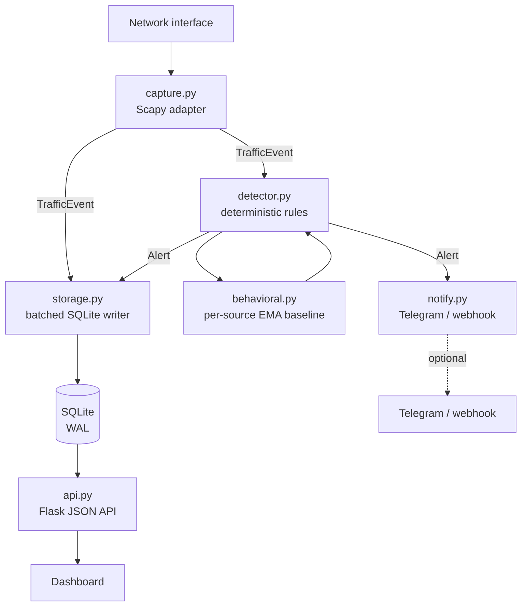

<div align="center">

# NEMOS

**Network Exposure Monitoring & Operations System**

A local-first, explainable network monitoring and intrusion-detection platform
for systems and networks you own or are authorized to monitor.

[](https://github.com/gautam11652-eng/NEMOS/actions/workflows/ci.yml)
[](https://www.python.org/)
[](LICENSE)

</div>

---

## What NEMOS is

NEMOS captures live network traffic, applies bounded deterministic detection
rules and a per-source statistical baseline, correlates related findings into
incidents, and presents them in a local SOC dashboard with the evidence behind
every alert. It runs entirely on one machine, requires no cloud service, and
sends no telemetry anywhere unless you configure an alert channel.

## What NEMOS is not

This section exists because these distinctions matter more than marketing does.

- **It is not machine learning, and it is not AI.** The behavioural component is
  an exponentially weighted moving average of per-source traffic features with
  an explicit sigma threshold. It is deliberately a transparent statistical
  baseline, not a trained model — every anomaly can be traced to a specific
  numeric deviation from that source's own observed history. See
  [Detection](#detection).
- **A risk score is not a probability of compromise.** It is analyst triage
  priority, computed from a documented formula.
- **An alert is not proof of an attack.** Detection thresholds are conservative
  by design and false positives are expected. NEMOS is a monitoring tool.
- **It does not block, contain, or respond.** There is no enforcement path, by
  design. The dashboard never executes containment actions.

## Highlights

- Live packet capture via Scapy, with explicit capture-state reporting
- Bounded, stateful detections: TCP SYN scans, UDP port scans, vertical port
  scans, network fan-out, ICMP sweeps and floods, SYN floods, DNS bursts,
  service-connection bursts and ARP mapping changes
- Per-source statistical baseline with noise floors and multi-feature
  corroboration, so one noisy metric cannot raise an alert alone
- Incident correlation with stable incident IDs and preserved evidence
- MITRE ATT&CK technique references **only** where the observed behaviour
  supports the mapping; generic anomalies stay explicitly unmapped
- Optional outbound alerting to Telegram or a webhook, with a severity floor,
  per-finding cooldown and rate limiting
- SQLite WAL storage behind a single batched writer thread with bounded,
  priority-aware backpressure
- Loopback-only by default; remote binds require a token
- 136 automated tests, CI across Python 3.10–3.13, lint and dependency audit

## Architecture



Two rules govern this design:

1. **The capture path stays cheap.** Detection is pure in-memory state that
   never touches the filesystem or SQLite, so packet processing never blocks on
   I/O. Storage and delivery are both asynchronous.
2. **Storage precedes delivery.** An alert is queued for persistence before it
   is queued for notification, so an unreachable Telegram API can never cost a
   recorded detection.

See [`docs/ARCHITECTURE.md`](docs/ARCHITECTURE.md) for module-level detail.

## Requirements

- Python 3.10 or newer
- Linux for packet capture (`CAP_NET_RAW`); the dashboard and API run anywhere

## Quick start

```bash
git clone https://github.com/gautam11652-eng/NEMOS.git
cd NEMOS
python3 -m venv .venv
source .venv/bin/activate
python -m pip install --upgrade pip
pip install -r requirements.txt
python main.py
```

Open <http://127.0.0.1:5000>.

To capture on a specific interface:

```bash
NEMOS_INTERFACE=eth0 python main.py
```

If capture fails with a permission error, grant only the capture capability
rather than running the web application as root — see
[Deployment](#deployment). The dashboard reports capture state explicitly, so a
permission failure appears as `CAPTURE BLOCKED` rather than as silent zeroes.

### Try it without capture

To see the detection pipeline end to end without touching a network interface:

```bash
python tools/validate_detection.py
```

This generates synthetic RFC 5737 documentation-address telemetry in memory. It
transmits nothing and scans nothing.

## Configuration

NEMOS reads a `.env` file next to `main.py` at startup. Real environment
variables always take precedence, so a systemd unit or an explicit `export` is
never overridden by a stale file. Copy `.env.example` to `.env` to begin.

### Core

| Variable | Default | Purpose |
| --- | --- | --- |
| `NEMOS_HOST` | `127.0.0.1` | Bind address |
| `NEMOS_PORT` | `5000` | Bind port |
| `NEMOS_INTERFACE` | *(auto)* | Capture interface |
| `NEMOS_CAPTURE` | `true` | Enable packet capture |
| `NEMOS_DB` | `data/nemos.db` | SQLite path |
| `NEMOS_API_TOKEN` | *(none)* | Required for any non-loopback bind |
| `NEMOS_TRUSTED_HOSTS` | *(none)* | Required for wildcard binds |
| `NEMOS_LOG_LEVEL` | `INFO` | Logging level |

### Retention and throughput

| Variable | Default | Purpose |
| --- | --- | --- |
| `NEMOS_MAX_TRAFFIC` | `100000` | Traffic rows retained |
| `NEMOS_MAX_ALERTS` | `10000` | Alert rows retained |
| `NEMOS_DB_BATCH` | `250` | Rows per write batch |
| `NEMOS_DB_FLUSH_SECONDS` | `0.5` | Maximum flush interval |
| `NEMOS_DASHBOARD_LIMIT` | `100` | Default dashboard page size |

### Baseline tuning

| Variable | Default | Purpose |
| --- | --- | --- |
| `NEMOS_BEHAVIOR_ALPHA` | `0.15` | EMA smoothing factor |
| `NEMOS_BEHAVIOR_MIN_SAMPLES` | `8` | Warm-up before the baseline can alert |
| `NEMOS_BEHAVIOR_SIGMA` | `3.0` | Deviation threshold |
| `NEMOS_BEHAVIOR_SAMPLE_SECONDS` | `5.0` | Sampling cadence |

## Detection

NEMOS combines two independent layers, and keeps them distinguishable.

### Deterministic rules

Bounded, stateful counters over a sliding window produce findings such as
`PORT_SCAN`, `TCP_SYN_SCAN`, `UDP_PORT_SCAN`, `ICMP_SWEEP`, `SYN_FLOOD_PATTERN`,
`DNS_BURST` and `ARP_MAPPING_CHANGE`. Each finding carries the evidence that
triggered it — the ports observed, the SYN ratio, the destination count.

### Statistical baseline

Each source host gets a profile of four features: packet rate, byte rate, unique
destinations and unique ports. Each is tracked as an exponentially weighted mean
and variance, sampled on a fixed cadence so a rolling window cannot let the
baseline quietly adapt to the burst it is supposed to catch.

Three properties keep this honest:

- **Warm-up.** A profile cannot raise an alert until it has `MIN_SAMPLES`
  observations. A host with no history is never called anomalous.
- **Noise floors.** A zero variance during a stable warm-up cannot turn a
  one-unit change into an effectively infinite z-score.
- **Corroboration.** The strongest deviation must be supported by an independent
  dimension unless it is extreme, so a single noisy feature is not treated as
  hostile.

The result is reported as `BEHAVIORAL_TRAFFIC_ANOMALY` with the pre-update
baseline, the observed values and the per-feature sigma deviations attached as
evidence. **This is a statistical model, not a trained one.**

### Scoring

Every alert carries a `risk_score` (0–100, analyst triage priority) and a
`confidence` (0–100, how strongly the evidence supports the finding). Incidents
combine the strongest constituent alert with bounded bonuses for independent
signals — distinct detections, distinct techniques, critical findings and
evidence count. The formula is in
[`nemos/intelligence.py`](nemos/intelligence.py) and is deliberately readable.

### ATT&CK mapping

A technique ID is attached only where the observed network behaviour supports
it. Scanning maps to `T1046`; DNS tunnelling patterns to `T1071.004`; floods to
`T1498`/`T1498.001`; ARP manipulation to `T1557.002`. A generic behavioural
anomaly is reported as an unmapped signal with a stated reason, rather than
being assigned a technique it does not evidence.

## Alert delivery

NEMOS records findings locally by default. It can also push them to Telegram or
a webhook. Delivery is off until you configure a channel, and it never blocks
packet capture.

### Telegram

1. Open Telegram and start a chat with **@BotFather**.
2. Create a bot with `/newbot` and copy the token.
3. Send a message to your bot, then obtain your chat ID.
4. Add both to `.env`:

```env
TELEGRAM_BOT_TOKEN=your_bot_token
TELEGRAM_CHAT_ID=your_chat_id
```

### Webhook

```env
NEMOS_WEBHOOK_URL=https://your-collector.example/hook
NEMOS_WEBHOOK_TOKEN=optional_bearer_token
```

The URL must be HTTPS unless it points at loopback: alert bodies describe your
network and are not sent in cleartext. Redirects are refused rather than
followed, so a redirect cannot downgrade the transport or retarget the payload.

### Tuning what gets sent

| Variable | Default | Purpose |
| --- | --- | --- |
| `NEMOS_NOTIFY` | `true` | Master switch |
| `NEMOS_NOTIFY_MIN_SEVERITY` | `HIGH` | `LOW`, `MEDIUM`, `HIGH`, `CRITICAL` |
| `NEMOS_NOTIFY_COOLDOWN` | `300` | Seconds before the same finding repeats |
| `NEMOS_NOTIFY_RATE` | `12` | Maximum messages per minute |
| `NEMOS_NOTIFY_TIMEOUT` | `5.0` | Per-request timeout |
| `NEMOS_NOTIFY_QUEUE` | `256` | Pending-delivery queue size |

The cooldown and rate limit exist so a port scan cannot turn the sensor into a
message flood. **Suppressed alerts are still recorded and still appear on the
dashboard** — only the outbound copy is dropped, and every suppression is
counted in `/api/notifications`.

The bot token is never returned by any endpoint and is redacted from logs and
error messages.

## API

| Endpoint | Purpose |
| --- | --- |
| `GET /api/health` | Liveness (public even when a token is set) |
| `GET /api/dashboard` | Consolidated dashboard snapshot (ETag-cached) |
| `GET /api/stats` | Telemetry counters |
| `GET /api/alerts` | Recent alerts, filterable |
| `GET /api/alerts/<id>` | Single alert with evidence |
| `GET /api/incidents` | Correlated incidents |
| `GET /api/incidents/<incident_id>` | Incident detail and triage summary |
| `GET /api/hosts` | Host risk index |
| `GET /api/hosts/<ip>` | Per-host investigation view |
| `GET /api/techniques` | ATT&CK catalog with observed counts |
| `GET /api/traffic` | Recent traffic events |
| `GET /api/status` | Capture, writer and delivery health |
| `GET /api/metrics` | Writer and delivery metrics |
| `GET /api/notifications` | Alert-delivery configuration and health |
| `POST /api/packet` | Test/compatibility ingestion |
| `POST /api/alerts/<id>/ack` | Acknowledge an alert |
| `POST /api/alerts/clear` | Clear alerts |

### Filtering alerts

`GET /api/alerts` accepts `severity` (repeatable), `source`, `threat`,
`technique`, `acknowledged`, `since` and `limit`:

```bash
curl 'http://127.0.0.1:5000/api/alerts?severity=CRITICAL&severity=HIGH&acknowledged=false'
curl 'http://127.0.0.1:5000/api/alerts?source=192.0.2.10&since=2026-01-01'
```

Every filter is validated and passed as a bound parameter.

When `NEMOS_API_TOKEN` is set, all `/api/*` endpoints except `/api/health`
require an `X-NEMOS-Token` header. The dashboard prompts for the token and keeps
it in `sessionStorage` only.

## Dashboard

A local SOC interface with a live detection timeline, security posture summary,
correlated-incident investigation with evidence and recommended next steps, a
host risk index, an ATT&CK coverage view, a connection graph, and sensor health
including capture state and writer backpressure.

## Testing

```bash
pip install -r requirements-dev.txt
python -m pytest -q                              # 136 tests
python -m compileall -q main.py nemos tests      # syntax
ruff check .                                     # lint
python -m pip_audit -r requirements.txt          # dependency audit
```

`make test`, `make compile`, `make audit` and `make demo` wrap the common ones.
CI runs the suite on Python 3.10–3.13 plus lint, dependency audit and a package
build on every push and pull request.

For a full environment check on Kali or another Debian-based host:

```bash
./scripts/verify-kali.sh
```

## Deployment

Run capture with the minimum capability rather than as root. From the project
root on a Debian-based host:

```bash
sudo ./install.sh
```

This creates the `nemos` service account, installs pinned dependencies into
`/opt/nemos/.venv`, creates `/var/lib/nemos` for the database, installs the
systemd unit and starts it. Configuration lives at `/etc/nemos/nemos.env`, and
the dashboard stays local-only at `http://127.0.0.1:5000` by default.

```bash
sudo systemctl status nemos
sudo journalctl -u nemos -f
```

The unit grants `CAP_NET_RAW` only and keeps the application process
unprivileged, while permitting the `AF_PACKET` and `AF_NETLINK` socket families
Scapy needs. See [`docs/DEPLOYMENT.md`](docs/DEPLOYMENT.md) for the manual
layout and for the post-install smoke test.

### Remote access

Do not bind to `0.0.0.0` casually. If you need a remote listener:

```bash
export NEMOS_HOST=0.0.0.0
export NEMOS_API_TOKEN="$(python3 -c 'import secrets; print(secrets.token_urlsafe(32))')"
export NEMOS_TRUSTED_HOSTS=192.168.1.50   # hostnames/IPs clients will actually use
python main.py
```

NEMOS refuses to start on a wildcard bind without both. Put HTTPS and a reverse
proxy in front of any deployment outside a trusted local network.

## Limitations

Stated plainly, because an evaluator will find them anyway:

- Detection is rule-based and statistical. There is no trained model.
- Traffic is stored as individual packet events; there is no flow-level
  aggregation layer.
- Encrypted payloads are not inspected. Detection is metadata-only.
- IPv4-oriented. IPv6 traffic is captured but detection heuristics are tuned for
  IPv4 topologies.
- Single-host. There is no multi-sensor federation or central collector.
- Retention is row-count based, not time based.

## Documentation

| Document | Contents |
| --- | --- |
| [`docs/ARCHITECTURE.md`](docs/ARCHITECTURE.md) | Module responsibilities and data flow |
| [`docs/DEPLOYMENT.md`](docs/DEPLOYMENT.md) | Production deployment and hardening |
| [`docs/RELEASE.md`](docs/RELEASE.md) | Release process |
| [`docs/SIH_DEMO.md`](docs/SIH_DEMO.md) | Safe demonstration plan |
| [`docs/DEMO_SCRIPT.md`](docs/DEMO_SCRIPT.md) | Demonstration walkthrough |
| [`AUDIT_REPORT.md`](AUDIT_REPORT.md) | Security properties and verification |
| [`CHANGELOG.md`](CHANGELOG.md) | Version history |
| [`SECURITY.md`](SECURITY.md) | Vulnerability reporting |
| [`CONTRIBUTING.md`](CONTRIBUTING.md) | Development workflow |

## Security model

NEMOS is a monitoring tool, not a guarantee of security. Thresholds are
conservative and should be tuned to the monitored environment. False positives
are possible and expected. Keep the host OS, Python runtime and dependencies
patched, and do not expose the application directly to untrusted networks.

Only monitor networks you own or are explicitly authorized to monitor.

## Contributing

See [`CONTRIBUTING.md`](CONTRIBUTING.md). Bug reports and detection-quality
feedback are both welcome — a false positive with the evidence attached is a
useful report.

## License

GPL-2.0-only. See [`LICENSE`](LICENSE) and
[`THIRD_PARTY_LICENSES.md`](THIRD_PARTY_LICENSES.md). Scapy is GPL-2.0-only, so
this project uses a GPL-compatible license.
